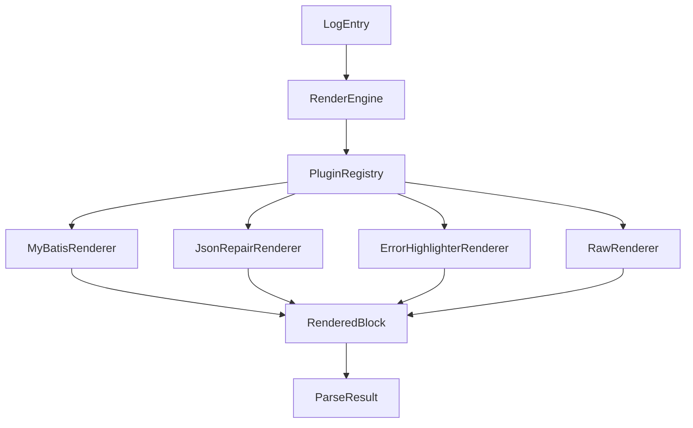
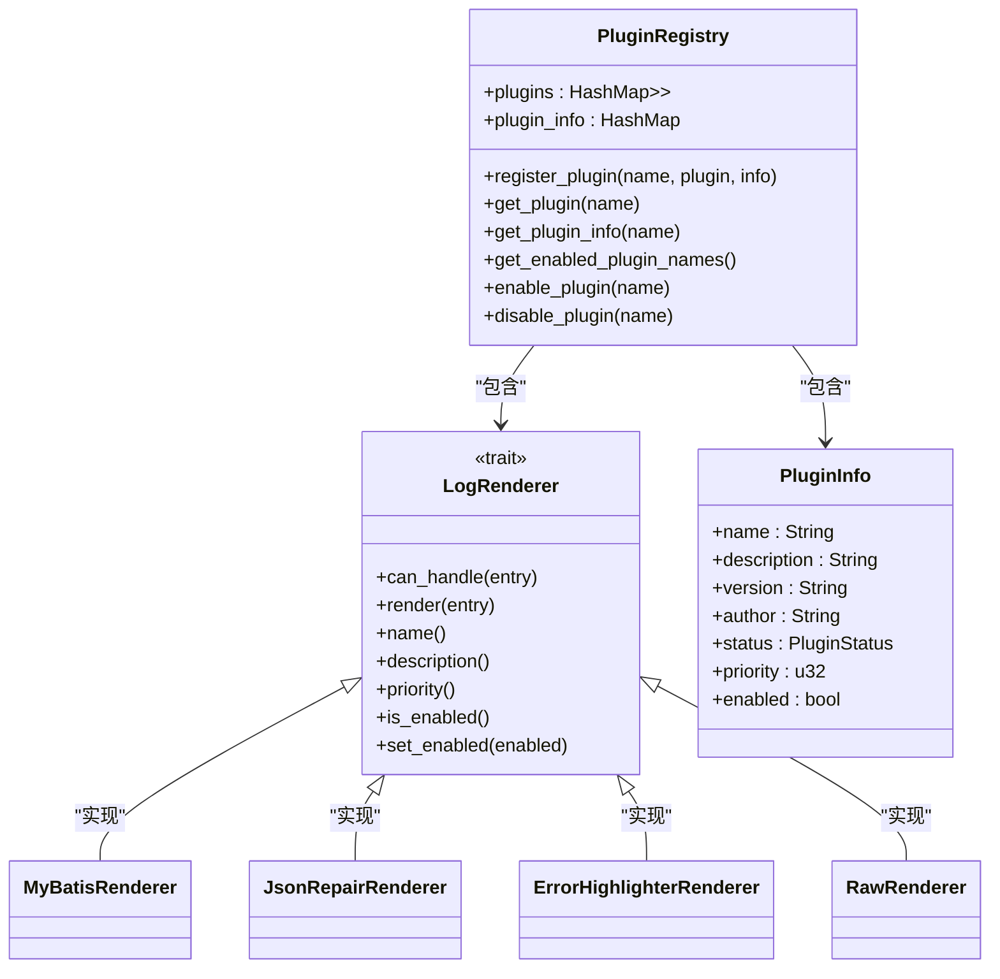
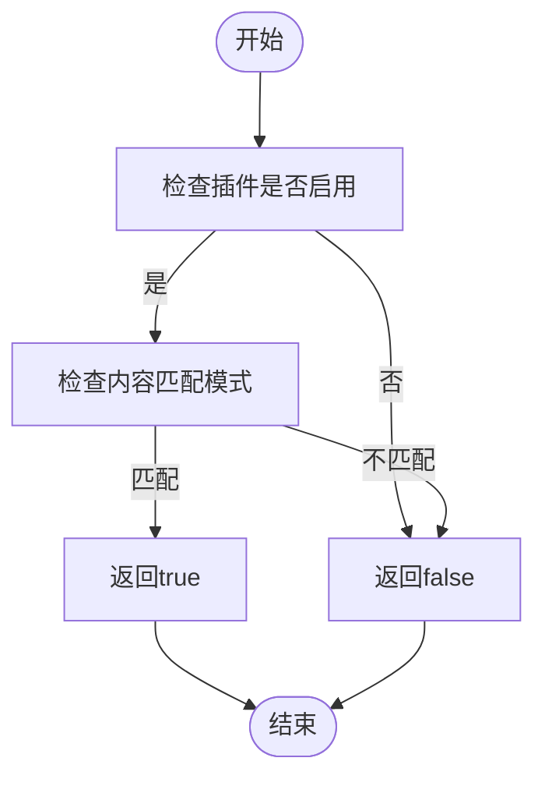
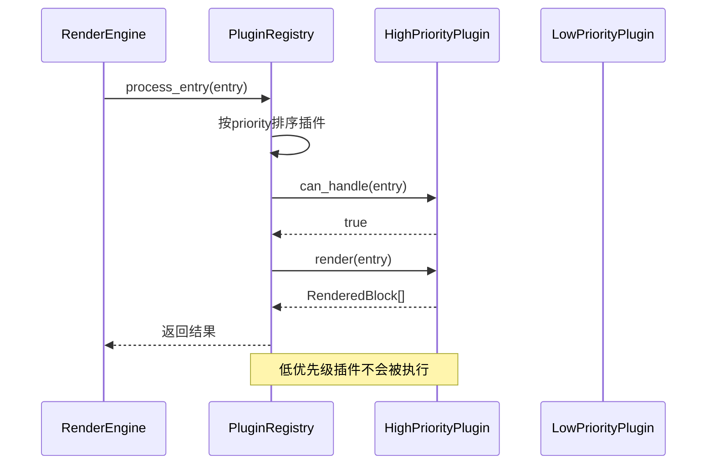
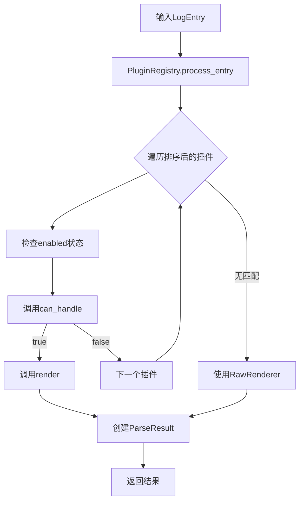
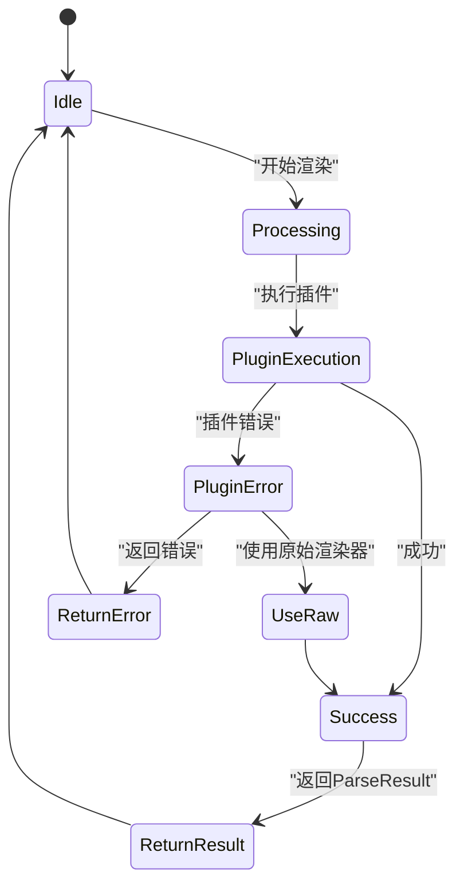
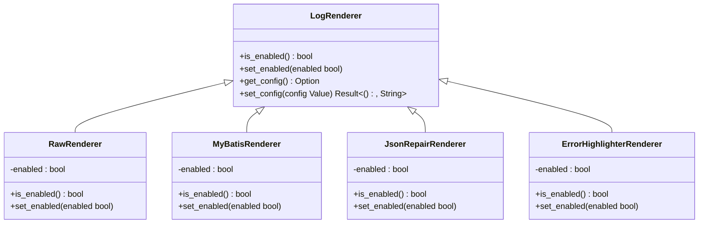

# 渲染引擎

<cite>
**本文档引用的文件**  
- [trait_def.rs](file://src-tauri/src/plugins/trait_def.rs)
- [registry.rs](file://src-tauri/src/plugins/registry.rs)
- [renderer.rs](file://src-tauri/src/parser/renderer.rs)
- [raw.rs](file://src-tauri/src/plugins/raw.rs)
- [mybatis.rs](file://src-tauri/src/plugins/mybatis.rs)
- [json_repair.rs](file://src-tauri/src/plugins/json_repair.rs)
- [error_highlighter.rs](file://src-tauri/src/plugins/error_highlighter.rs)
- [rendered_block.rs](file://src-tauri/src/models/rendered_block.rs)
- [log_entry.rs](file://src-tauri/src/models/log_entry.rs)
- [plugin_config.rs](file://src-tauri/src/models/plugin_config.rs)
</cite>

## 目录
1. [简介](#简介)
2. [核心架构](#核心架构)
3. [插件注册与管理机制](#插件注册与管理机制)
4. [插件调度流程](#插件调度流程)
5. [优先级排序与冲突处理](#优先级排序与冲突处理)
6. [渲染流程与结果聚合](#渲染流程与结果聚合)
7. [错误处理与异常恢复](#错误处理与异常恢复)
8. [插件状态与配置管理](#插件状态与配置管理)
9. [插件开发指南](#插件开发指南)
10. [总结](#总结)

## 简介
本技术文档深入解析日志渲染引擎的核心机制，重点阐述`Renderer`如何集成并调度各类插件对日志条目进行可视化转换。文档详细说明插件注册机制、多态调用方式、处理能力判断逻辑、优先级排序算法、渲染结果聚合策略、错误传播路径及插件状态管理，为开发者提供完整的插件开发指导。

## 核心架构

**图示来源**  
- [renderer.rs](file://src-tauri/src/parser/renderer.rs#L5-L9)
- [registry.rs](file://src-tauri/src/plugins/registry.rs#L4-L10)
- [trait_def.rs](file://src-tauri/src/plugins/trait_def.rs#L2-L43)

**本节来源**  
- [renderer.rs](file://src-tauri/src/parser/renderer.rs#L5-L9)
- [registry.rs](file://src-tauri/src/plugins/registry.rs#L4-L10)

## 插件注册与管理机制

渲染引擎通过`PluginRegistry`实现插件的集中注册与管理。所有插件均需实现`LogRenderer` trait，通过`register_plugin`方法注册到中心注册表中。注册时需提供插件实例和`PluginInfo`元数据，包括名称、描述、优先级等信息。

系统在初始化时自动注册默认插件集，包括MyBatis SQL解析器、JSON修复器、错误高亮器和原始文本渲染器。每个插件通过`Arc<RwLock<>>`包装，确保线程安全的并发访问。

**图示来源**  
- [registry.rs](file://src-tauri/src/plugins/registry.rs#L4-L242)
- [trait_def.rs](file://src-tauri/src/plugins/trait_def.rs#L2-L43)

**本节来源**  
- [registry.rs](file://src-tauri/src/plugins/registry.rs#L4-L242)
- [trait_def.rs](file://src-tauri/src/plugins/trait_def.rs#L2-L43)

## 插件调度流程

### 多态调用机制
`LogRenderer` trait定义了统一的接口规范，通过Rust的trait对象实现多态调用。所有插件共享相同的调用接口，但具有各自独立的实现逻辑。这种设计实现了"一个接口，多种实现"的多态特性。

### can_handle判断逻辑
`can_handle`方法是插件参与处理的决策核心。每个插件根据自身特性定义匹配规则：

- **ErrorHighlighterRenderer**: 检测内容中是否包含错误或警告关键词
- **JsonRepairRenderer**: 使用正则表达式匹配JSON结构
- **MyBatisRenderer**: 识别MyBatis日志中的"Preparing:"和"Parameters:"模式
- **RawRenderer**: 始终返回true，作为兜底插件

所有插件首先检查`enabled`状态，禁用状态直接返回false。

**图示来源**  
- [error_highlighter.rs](file://src-tauri/src/plugins/error_highlighter.rs#L69-L75)
- [json_repair.rs](file://src-tauri/src/plugins/json_repair.rs#L115-L121)
- [mybatis.rs](file://src-tauri/src/plugins/mybatis.rs#L199-L206)
- [raw.rs](file://src-tauri/src/plugins/raw.rs#L29-L32)

**本节来源**  
- [trait_def.rs](file://src-tauri/src/plugins/trait_def.rs#L4-L5)
- [error_highlighter.rs](file://src-tauri/src/plugins/error_highlighter.rs#L69-L75)

## 优先级排序与冲突处理

### 优先级算法
系统采用数值越小优先级越高的排序策略。`PluginInfo`中的`priority`字段决定插件执行顺序。内置插件优先级设置如下：

- ErrorHighlighter: 5（最高）
- MyBatis: 10
- JSON: 20
- Raw: 1000（最低）

### 冲突处理机制
当多个插件都能处理同一日志条目时，系统按优先级顺序执行，但仅采用第一个成功处理的插件结果。这种"首次匹配"策略避免了结果冲突。

**图示来源**  
- [registry.rs](file://src-tauri/src/plugins/registry.rs#L171-L210)
- [plugin_config.rs](file://src-tauri/src/models/plugin_config.rs#L71-L84)

**本节来源**  
- [registry.rs](file://src-tauri/src/plugins/registry.rs#L171-L210)
- [plugin_config.rs](file://src-tauri/src/models/plugin_config.rs#L71-L84)

## 渲染流程与结果聚合

### 渲染方法执行
`render`方法将日志条目转换为一个或多个`RenderedBlock`对象。每个`RenderedBlock`包含：

- 唯一标识符
- 块类型（SQL、JSON、Error等）
- 标题和内容
- 格式化后的内容
- 元数据（行号、置信度等）

### 结果聚合策略
渲染引擎通过`RenderEngine`的`render_entry`方法协调插件执行。处理流程如下：

1. 调用`PluginRegistry.process_entry`
2. 按优先级遍历启用的插件
3. 执行`can_handle`判断
4. 调用`render`方法获取结果
5. 封装为`ParseResult`返回

**图示来源**  
- [renderer.rs](file://src-tauri/src/parser/renderer.rs#L5-L241)
- [rendered_block.rs](file://src-tauri/src/models/rendered_block.rs#L2-L19)

**本节来源**  
- [renderer.rs](file://src-tauri/src/parser/renderer.rs#L5-L241)
- [rendered_block.rs](file://src-tauri/src/models/rendered_block.rs#L2-L19)

## 错误处理与异常恢复

### RenderError类型
系统定义了三种错误类型：

- **RenderFailed**: 渲染过程失败
- **PluginError**: 插件执行错误
- **ConfigError**: 配置相关错误

### 错误传播路径
错误通过Result类型逐层向上传播：

1. 插件内部产生错误
2. `PluginResult`封装错误信息
3. `RenderEngine`转换为`RenderError`
4. 向上层调用者返回Result

### 异常恢复策略
系统采用降级恢复机制：

- 单个插件失败不影响其他插件
- 无插件匹配时使用`RawRenderer`兜底
- 错误信息以`RenderedBlock`形式展示

**图示来源**  
- [renderer.rs](file://src-tauri/src/parser/renderer.rs#L171-L182)
- [renderer.rs](file://src-tauri/src/parser/renderer.rs#L184-L194)

**本节来源**  
- [renderer.rs](file://src-tauri/src/parser/renderer.rs#L171-L194)

## 插件状态与配置管理

### 启用状态管理
所有插件继承`is_enabled`和`set_enabled`方法：

- `is_enabled`: 返回`enabled`字段值
- `set_enabled`: 更新`enabled`字段

状态变更通过`PluginRegistry`同步到`PluginInfo`。

### 配置传递机制
`get_config`和`set_config`方法提供配置管理接口：

- `get_config`: 返回插件当前配置（Option<Value>）
- `set_config`: 接收JSON值并验证设置

**图示来源**  
- [trait_def.rs](file://src-tauri/src/plugins/trait_def.rs#L24-L42)
- [raw.rs](file://src-tauri/src/plugins/raw.rs#L61-L67)
- [mybatis.rs](file://src-tauri/src/plugins/mybatis.rs#L270-L276)

**本节来源**  
- [trait_def.rs](file://src-tauri/src/plugins/trait_def.rs#L24-L42)
- [raw.rs](file://src-tauri/src/plugins/raw.rs#L61-L67)

## 插件开发指南

### 实现新插件步骤
1. 创建结构体实现`LogRenderer` trait
2. 实现`can_handle`