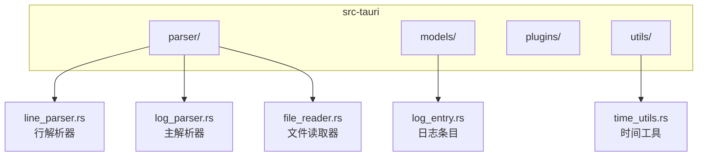
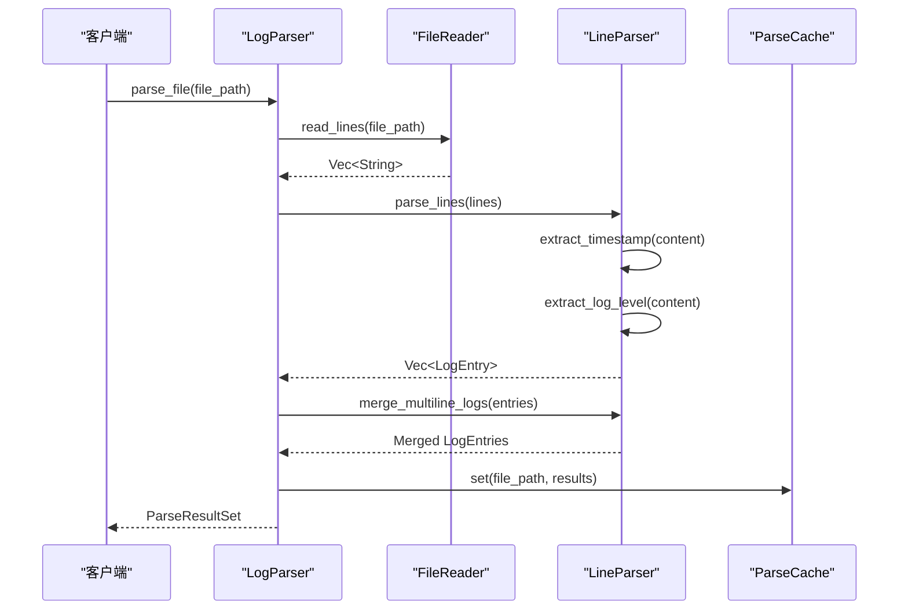
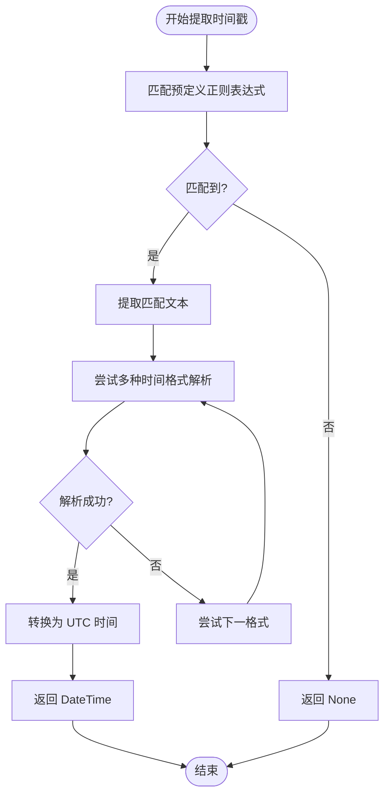
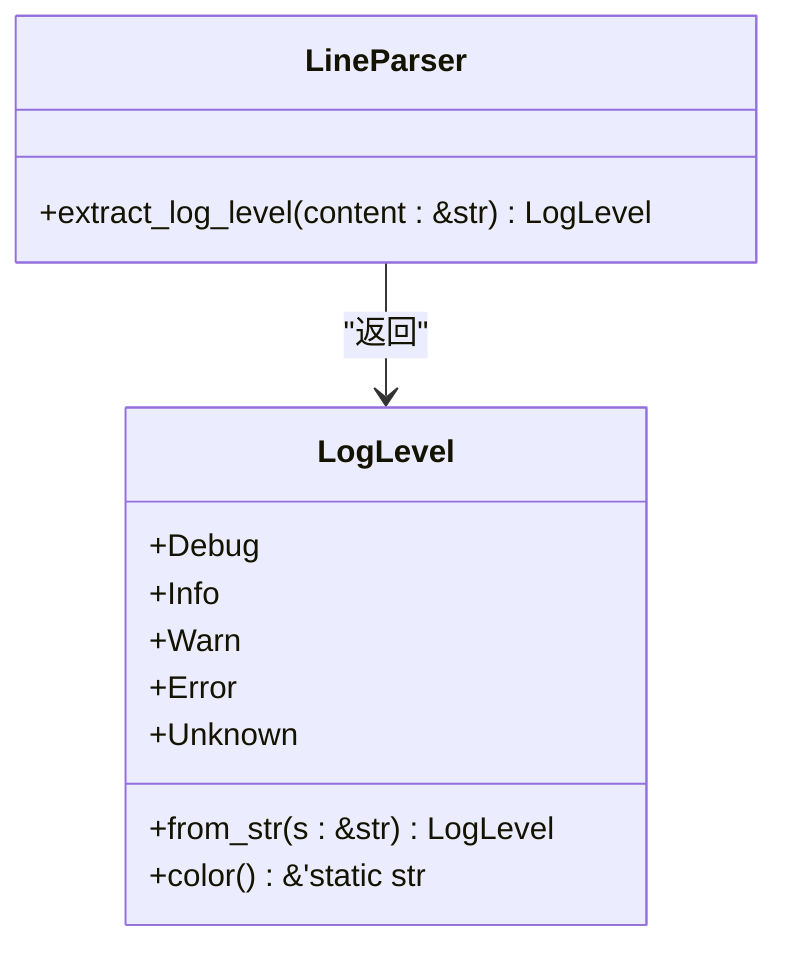
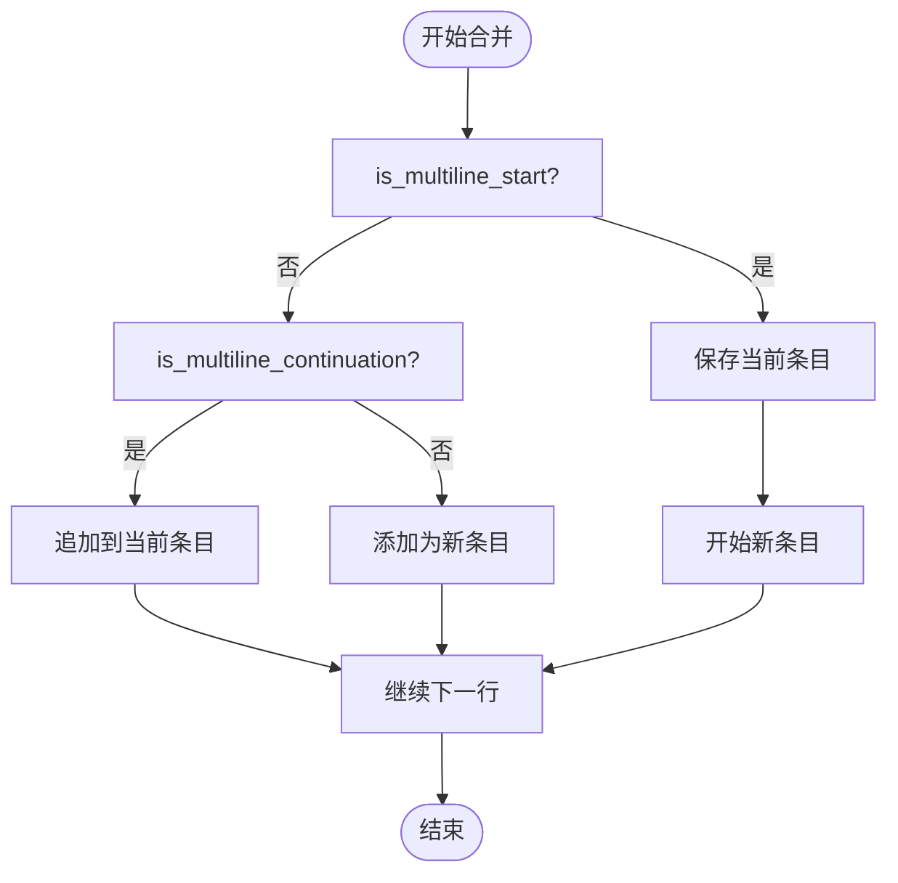
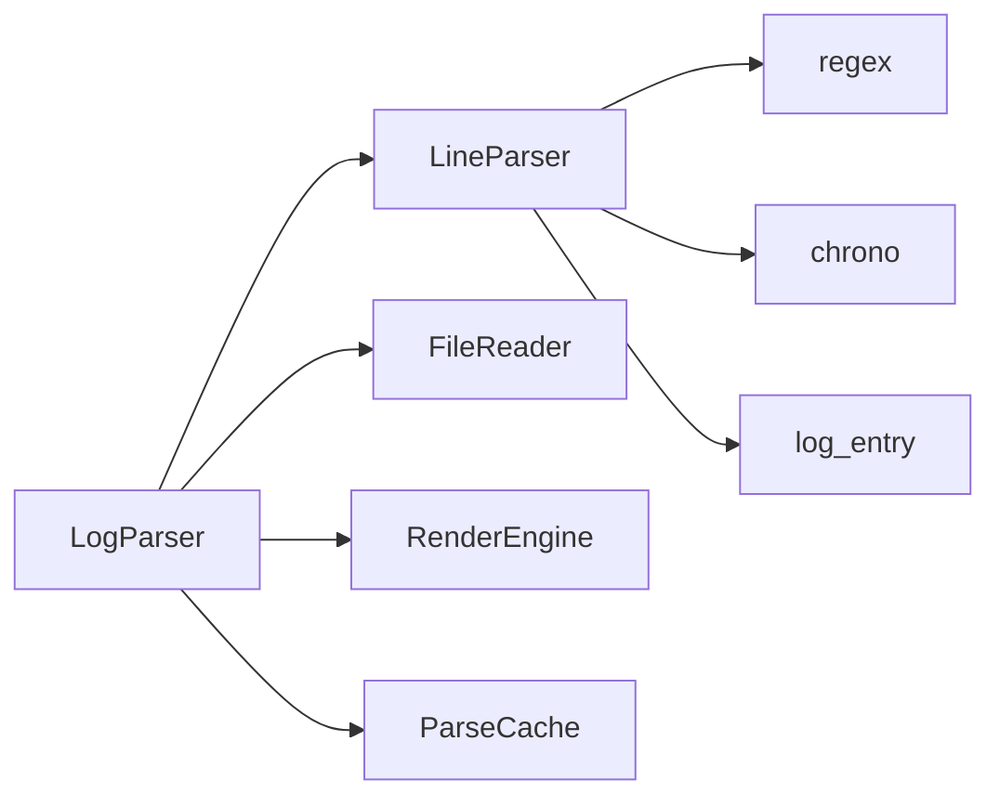

# 行解析器

<cite>
**本文档中引用的文件**  
- [line_parser.rs](file://src-tauri/src/parser/line_parser.rs)
- [log_entry.rs](file://src-tauri/src/models/log_entry.rs)
- [log_parser.rs](file://src-tauri/src/parser/log_parser.rs)
- [time_utils.rs](file://src-tauri/src/utils/time_utils.rs)
- [file_reader.rs](file://src-tauri/src/parser/file_reader.rs)
</cite>

## 目录
1. [简介](#简介)
2. [项目结构](#项目结构)
3. [核心组件](#核心组件)
4. [架构概述](#架构概述)
5. [详细组件分析](#详细组件分析)
6. [依赖分析](#依赖分析)
7. [性能考虑](#性能考虑)
8. [故障排除指南](#故障排除指南)
9. [结论](#结论)

## 简介
本文档深入解析 `LogWhisper` 日志分析工具中的行解析器（LineParser）模块，详细说明其如何将原始日志行转换为结构化的 `LogEntry` 对象。重点阐述时间戳提取、日志级别识别、多行日志合并等核心机制，并结合代码实现说明其容错性与扩展性。

## 项目结构

**图示来源**  
- [line_parser.rs](file://src-tauri/src/parser/line_parser.rs#L4-L8)
- [log_entry.rs](file://src-tauri/src/models/log_entry.rs#L3-L16)
- [log_parser.rs](file://src-tauri/src/parser/log_parser.rs#L7-L14)
- [time_utils.rs](file://src-tauri/src/utils/time_utils.rs#L4-L9)
- [file_reader.rs](file://src-tauri/src/parser/file_reader.rs#L4-L9)

**本节来源**  
- [line_parser.rs](file://src-tauri/src/parser/line_parser.rs#L1-L245)
- [log_entry.rs](file://src-tauri/src/models/log_entry.rs#L1-L137)
- [log_parser.rs](file://src-tauri/src/parser/log_parser.rs#L1-L246)

## 核心组件

`LineParser` 是日志解析流程的核心，负责将原始文本行解析为结构化的 `LogEntry` 对象。它通过正则表达式匹配时间戳和日志级别，并支持多行日志的合并。`LogEntry` 结构体定义了日志条目的标准数据模型，包含行号、时间戳、级别、内容等字段。

**本节来源**  
- [line_parser.rs](file://src-tauri/src/parser/line_parser.rs#L4-L8)
- [log_entry.rs](file://src-tauri/src/models/log_entry.rs#L3-L16)

## 架构概述

**图示来源**  
- [log_parser.rs](file://src-tauri/src/parser/log_parser.rs#L7-L14)
- [line_parser.rs](file://src-tauri/src/parser/line_parser.rs#L4-L8)
- [file_reader.rs](file://src-tauri/src/parser/file_reader.rs#L4-L9)
- [cache.rs](file://src-tauri/src/parser/cache.rs#L4-L9)

## 详细组件分析

### 行解析器分析

`LineParser` 模块实现了日志行的结构化解析，其核心功能包括时间戳提取、日志级别识别和多行日志合并。

#### 时间戳提取机制

**图示来源**  
- [line_parser.rs](file://src-tauri/src/parser/line_parser.rs#L50-L90)
- [time_utils.rs](file://src-tauri/src/utils/time_utils.rs#L4-L81)

#### 日志级别识别机制

**图示来源**  
- [line_parser.rs](file://src-tauri/src/parser/line_parser.rs#L92-L130)
- [log_entry.rs](file://src-tauri/src/models/log_entry.rs#L20-L60)

#### 多行日志合并策略

**图示来源**  
- [line_parser.rs](file://src-tauri/src/parser/line_parser.rs#L132-L180)

**本节来源**  
- [line_parser.rs](file://src-tauri/src/parser/line_parser.rs#L1-L245)
- [log_entry.rs](file://src-tauri/src/models/log_entry.rs#L1-L137)

## 依赖分析

**图示来源**  
- [Cargo.toml](file://src-tauri/Cargo.toml#L1-L55)
- [mod.rs](file://src-tauri/src/parser/mod.rs#L1-L11)

**本节来源**  
- [line_parser.rs](file://src-tauri/src/parser/line_parser.rs#L1-L245)
- [log_parser.rs](file://src-tauri/src/parser/log_parser.rs#L1-L246)
- [file_reader.rs](file://src-tauri/src/parser/file_reader.rs#L1-L200)

## 性能考虑
`LineParser` 采用预编译的正则表达式列表进行模式匹配，避免了运行时编译开销。多行日志合并采用流式处理，避免了中间数据的重复拷贝。时间解析使用 `chrono` 库的高效解析器，并按优先级尝试常见格式。

## 故障排除指南

当解析失败时，系统会保留原始行内容和行号，并将级别设为 `Unknown`。可通过以下方式排查问题：
- 检查日志格式是否包含时间戳或级别标识
- 验证文件编码是否为 UTF-8 或 GBK
- 确认文件大小未超过 50MB 限制
- 查看控制台输出的编码检测结果

**本节来源**  
- [line_parser.rs](file://src-tauri/src/parser/line_parser.rs#L1-L245)
- [file_reader.rs](file://src-tauri/src/parser/file_reader.rs#L1-L200)

## 结论
`LineParser` 模块设计合理，具备良好的扩展性和容错能力。它支持多种常见日志格式（如 Log4j、SLF4J），并通过正则表达式和启发式规则实现高精度解析。未来可通过插件机制支持更多自定义格式。