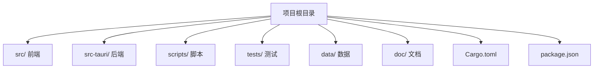
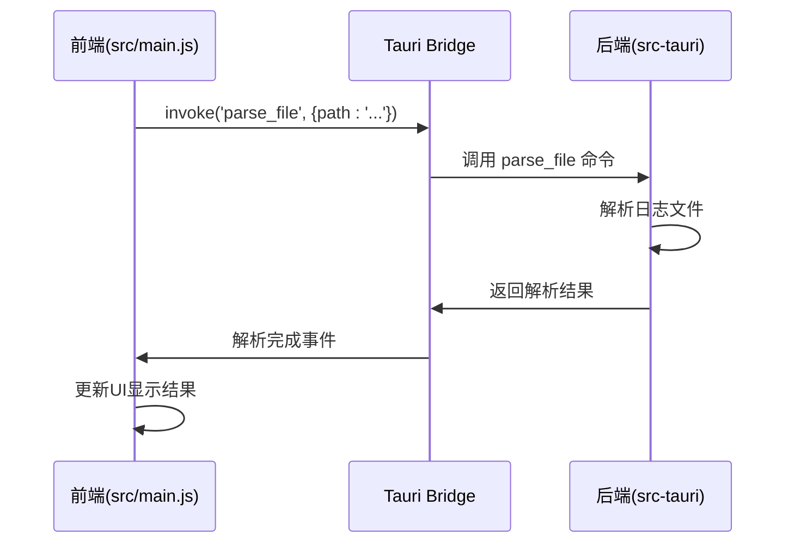
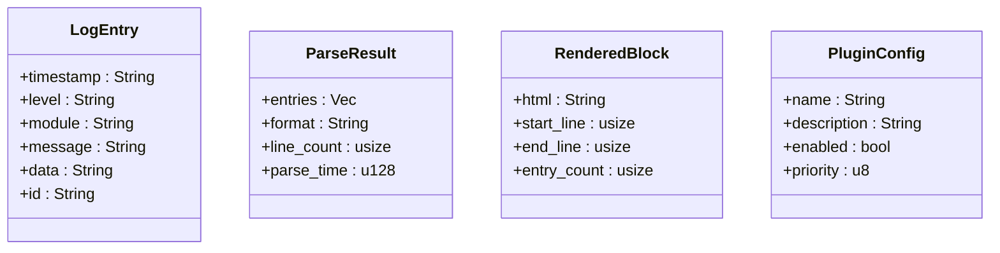
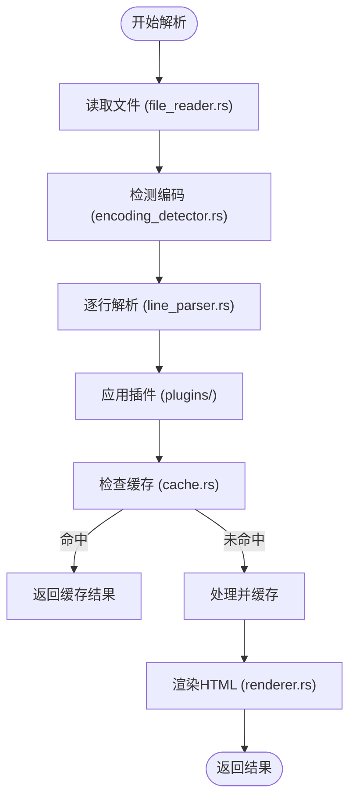
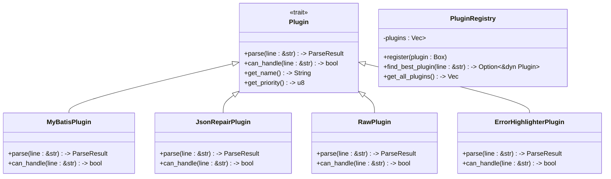
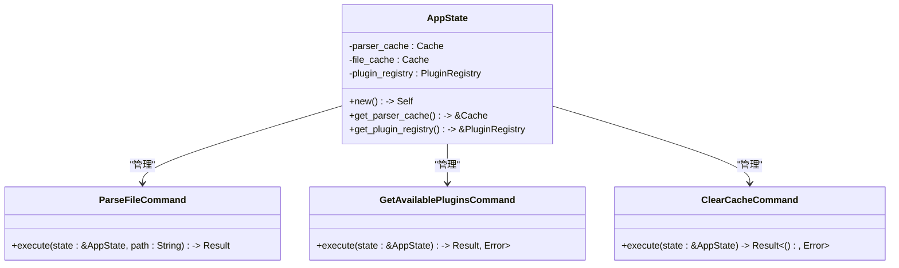
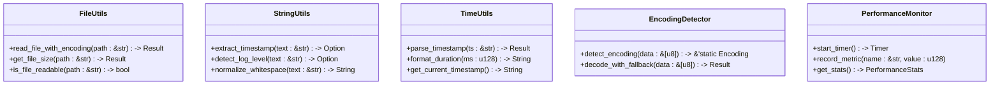

# 项目结构

<cite>
**本文档中引用的文件**  
- [main.js](file://src/main.js)
- [index.html](file://src/index.html)
- [style.css](file://src/style.css)
- [lib.rs](file://src-tauri/src/lib.rs)
- [main.rs](file://src-tauri/src/main.rs)
- [Cargo.toml](file://src-tauri/Cargo.toml)
- [Cargo.toml](file://Cargo.toml)
- [package.json](file://package.json)
- [log_entry.rs](file://src-tauri/src/models/log_entry.rs)
- [parse_result.rs](file://src-tauri/src/models/parse_result.rs)
- [plugin_config.rs](file://src-tauri/src/models/plugin_config.rs)
- [rendered_block.rs](file://src-tauri/src/models/rendered_block.rs)
- [log_parser.rs](file://src-tauri/src/parser/log_parser.rs)
- [file_reader.rs](file://src-tauri/src/parser/file_reader.rs)
- [line_parser.rs](file://src-tauri/src/parser/line_parser.rs)
- [renderer.rs](file://src-tauri/src/parser/renderer.rs)
- [cache.rs](file://src-tauri/src/parser/cache.rs)
- [mybatis.rs](file://src-tauri/src/plugins/mybatis.rs)
- [json_repair.rs](file://src-tauri/src/plugins/json_repair.rs)
- [error_highlighter.rs](file://src-tauri/src/plugins/error_highlighter.rs)
- [raw.rs](file://src-tauri/src/plugins/raw.rs)
- [registry.rs](file://src-tauri/src/plugins/registry.rs)
- [trait_def.rs](file://src-tauri/src/plugins/trait_def.rs)
- [commands.rs](file://src-tauri/src/tauri/commands.rs)
- [handlers.rs](file://src-tauri/src/tauri/handlers.rs)
- [state.rs](file://src-tauri/src/tauri/state.rs)
- [events.rs](file://src-tauri/src/tauri/events.rs)
- [file_utils.rs](file://src-tauri/src/utils/file_utils.rs)
- [string_utils.rs](file://src-tauri/src/utils/string_utils.rs)
- [time_utils.rs](file://src-tauri/src/utils/time_utils.rs)
- [encoding_detector.rs](file://src-tauri/src/utils/encoding_detector.rs)
- [performance.rs](file://src-tauri/src/utils/performance.rs)
- [build.sh](file://scripts/build.sh)
- [test.sh](file://scripts/test.sh)
- [release.sh](file://scripts/release.sh)
- [parse_workflow_test.rs](file://tests/integration/parse_workflow_test.rs)
</cite>

## 目录
1. [简介](#简介)
2. [项目结构概览](#项目结构概览)
3. [前后端分离设计](#前后端分离设计)
4. [后端模块职责划分](#后端模块职责划分)
5. [Rust依赖项分析](#rust依赖项分析)
6. [前端资源组织](#前端资源组织)
7. [构建与发布脚本](#构建与发布脚本)
8. [集成测试结构](#集成测试结构)
9. [开发者导航建议](#开发者导航建议)

## 简介
LogWhisper 是一个轻量级桌面日志分析工具，采用 Tauri 框架构建，实现了前后端分离的架构设计。本项目结构文档旨在全面解析代码库的组织逻辑，帮助开发者快速理解系统架构、模块职责和交互方式。

## 项目结构概览
项目采用典型的 Tauri 应用结构，分为前端（src/）和后端（src-tauri/）两个主要部分。根目录包含构建配置、脚本和测试文件，`data/` 目录存放示例数据，`doc/` 目录存放各类设计文档。

**图示来源**  
- [项目结构规划.md](file://doc/项目结构规划.md)

## 前后端分离设计
LogWhisper 采用清晰的前后端分离架构，前端负责用户界面展示和交互，后端处理核心业务逻辑和文件操作。

### 前端（src/）
- **index.html**: 应用主页面，包含 UI 结构
- **main.js**: 前端逻辑控制，通过 Tauri API 与后端通信
- **style.css**: 样式定义

### 后端（src-tauri/）
- **src/**: Rust 核心逻辑
- **Cargo.toml**: Rust 依赖管理
- **tauri.conf.json**: Tauri 配置文件
- **build.rs**: 构建脚本

前后端通过 Tauri 的 `invoke` 机制进行异步通信，前端调用后端命令，后端返回结果。

**图示来源**  
- [main.js](file://src/main.js#L319-L338)
- [lib.rs](file://src-tauri/src/lib.rs#L15-L70)
- [commands.rs](file://src-tauri/src/tauri/commands.rs)

**本节来源**  
- [main.js](file://src/main.js#L78-L92)
- [lib.rs](file://src-tauri/src/lib.rs#L15-L70)

## 后端模块职责划分
src-tauri/src 目录下采用模块化设计，各模块职责明确，耦合度低。

### models 模块
定义核心数据结构，包括：
- **log_entry.rs**: 日志条目模型
- **parse_result.rs**: 解析结果结构
- **plugin_config.rs**: 插件配置
- **rendered_block.rs**: 渲染块数据

**图示来源**  
- [log_entry.rs](file://src-tauri/src/models/log_entry.rs)
- [parse_result.rs](file://src-tauri/src/models/parse_result.rs)
- [rendered_block.rs](file://src-tauri/src/models/rendered_block.rs)
- [plugin_config.rs](file://src-tauri/src/models/plugin_config.rs)

### parser 模块
负责日志文件的解析和渲染：
- **log_parser.rs**: 主解析器，协调文件读取和行解析
- **file_reader.rs**: 文件读取和编码检测
- **line_parser.rs**: 单行日志解析
- **renderer.rs**: HTML 渲染
- **cache.rs**: 解析结果缓存

**图示来源**  
- [log_parser.rs](file://src-tauri/src/parser/log_parser.rs)
- [file_reader.rs](file://src-tauri/src/parser/file_reader.rs)
- [line_parser.rs](file://src-tauri/src/parser/line_parser.rs)
- [cache.rs](file://src-tauri/src/parser/cache.rs)

### plugins 模块
插件系统实现，支持多种日志格式：
- **trait_def.rs**: 插件接口定义
- **mybatis.rs**: MyBatis SQL 解析插件
- **json_repair.rs**: JSON 修复插件
- **error_highlighter.rs**: 错误高亮插件
- **raw.rs**: 原始文本插件
- **registry.rs**: 插件注册和管理

**图示来源**  
- [trait_def.rs](file://src-tauri/src/plugins/trait_def.rs)
- [mybatis.rs](file://src-tauri/src/plugins/mybatis.rs)
- [json_repair.rs](file://src-tauri/src/plugins/json_repair.rs)
- [registry.rs](file://src-tauri/src/plugins/registry.rs)

### tauri 模块
Tauri 集成层，处理命令和状态：
- **commands.rs**: Tauri 命令实现
- **handlers.rs**: 事件处理器
- **state.rs**: 应用状态管理
- **events.rs**: 自定义事件定义

**图示来源**  
- [state.rs](file://src-tauri/src/tauri/state.rs)
- [commands.rs](file://src-tauri/src/tauri/commands.rs)

### utils 模块
通用工具函数：
- **file_utils.rs**: 文件操作工具
- **string_utils.rs**: 字符串处理
- **time_utils.rs**: 时间处理
- **encoding_detector.rs**: 编码检测
- **performance.rs**: 性能监控

**图示来源**  
- [file_utils.rs](file://src-tauri/src/utils/file_utils.rs)
- [string_utils.rs](file://src-tauri/src/utils/string_utils.rs)
- [time_utils.rs](file://src-tauri/src/utils/time_utils.rs)
- [encoding_detector.rs](file://src-tauri/src/utils/encoding_detector.rs)

**本节来源**  
- [mod.rs](file://src-tauri/src/models/mod.rs)
- [mod.rs](file://src-tauri/src/parser/mod.rs)
- [mod.rs](file://src-tauri/src/plugins/mod.rs)
- [mod.rs](file://src-tauri/src/tauri/mod.rs)
- [mod.rs](file://src-tauri/src/utils/mod.rs)

## Rust依赖项分析
Cargo.toml 中的依赖项选择基于功能需求和性能考虑。

### 核心依赖
- **serde**: 数据序列化/反序列化，用于配置和数据交换
- **serde_json**: JSON 处理，支持插件配置和API通信
- **regex**: 正则表达式，用于日志行解析和模式匹配
- **chrono**: 时间处理，解析和格式化时间戳
- **tokio**: 异步运行