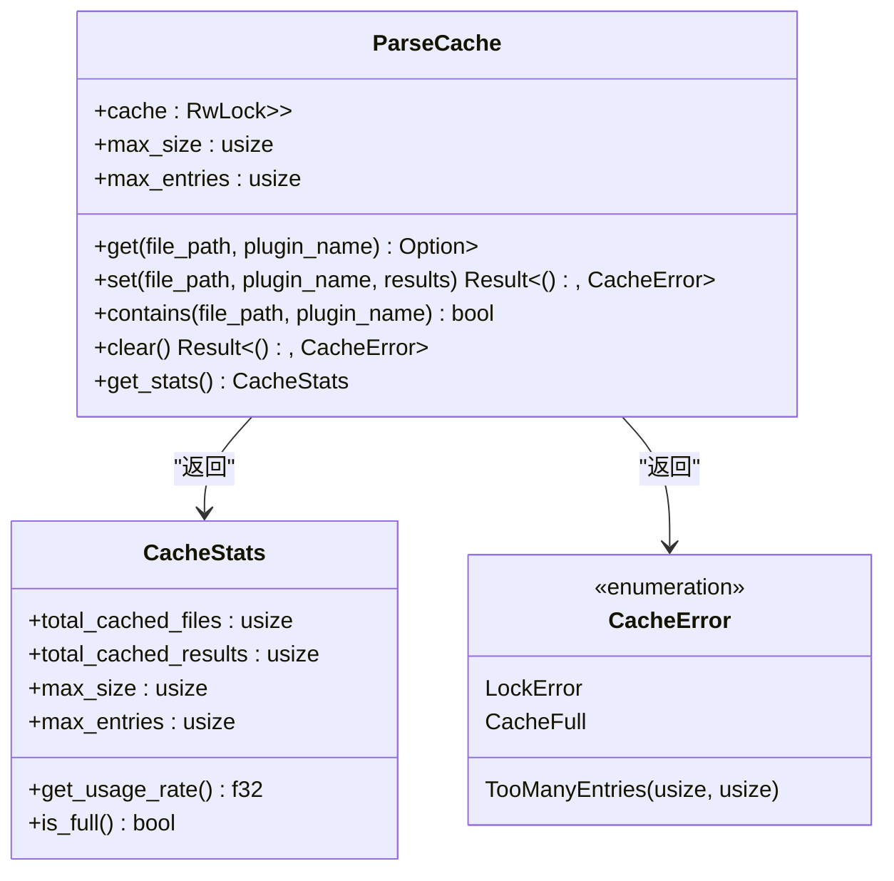
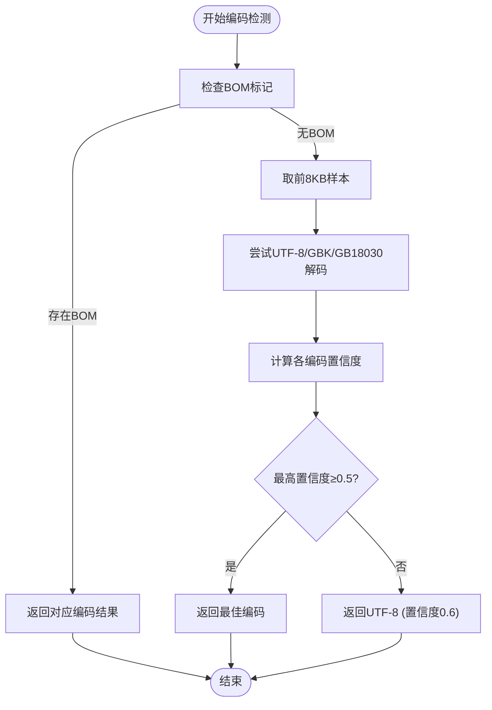
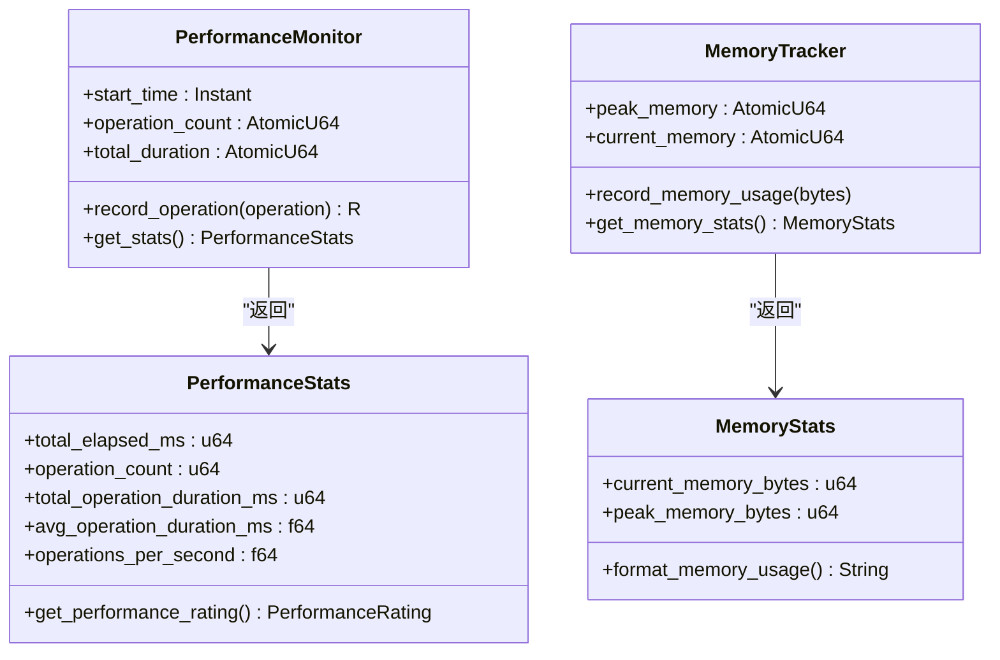
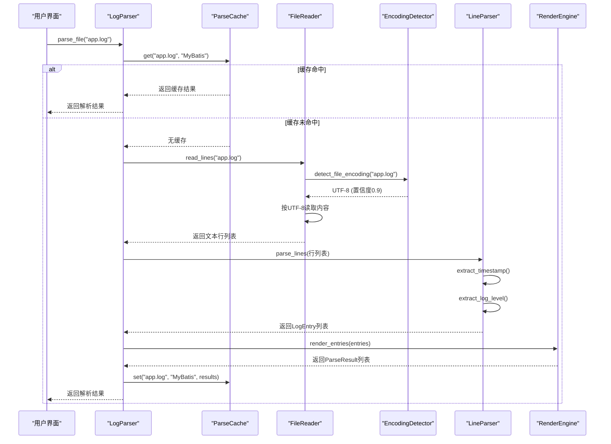

# 工具服务

<cite>
**本文档引用文件**  
- [cache.rs](file://src-tauri/src/parser/cache.rs)
- [encoding_detector.rs](file://src-tauri/src/utils/encoding_detector.rs)
- [time_utils.rs](file://src-tauri/src/utils/time_utils.rs)
- [performance.rs](file://src-tauri/src/utils/performance.rs)
- [file_reader.rs](file://src-tauri/src/parser/file_reader.rs)
- [log_parser.rs](file://src-tauri/src/parser/log_parser.rs)
</cite>

## 目录
1. [引言](#引言)
2. [核心工具服务组件](#核心工具服务组件)
3. [LRU缓存机制](#lru缓存机制)
4. [多算法编码检测](#多算法编码检测)
5. [时间戳解析器](#时间戳解析器)
6. [性能采样器](#性能采样器)
7. [工具集成调用链路](#工具集成调用链路)
8. [扩展接口建议](#扩展接口建议)

## 引言
本系统通过一系列工具服务组件提升日志解析效率与准确性。这些工具包括基于LRU策略的解析缓存、多算法组合的编码检测器、兼容多种格式的时间戳解析器以及性能监控模块。各组件协同工作，确保系统在处理大规模日志文件时具备高效性、准确性和可扩展性。

## 核心工具服务组件
系统核心依赖于四个关键工具服务组件：`ParseCache` 实现解析结果缓存以避免重复计算；`EncodingDetector` 采用多算法组合策略自动识别文件编码；`TimeUtils` 提供灵活的时间戳解析能力；`PerformanceMonitor` 支持性能瓶颈定位。这些组件通过模块化设计集成至主解析流程，为上层功能提供稳定支撑。

**本节来源**  
- [cache.rs](file://src-tauri/src/parser/cache.rs#L1-L194)
- [encoding_detector.rs](file://src-tauri/src/utils/encoding_detector.rs#L1-L277)
- [time_utils.rs](file://src-tauri/src/utils/time_utils.rs#L1-L82)
- [performance.rs](file://src-tauri/src/utils/performance.rs#L1-L176)

## LRU缓存机制
`ParseCache` 组件采用读写锁保护的哈希表实现线程安全的解析结果缓存。其核心机制基于LRU（最近最少使用）策略，当缓存条目数达到上限时，优先清除最旧条目以腾出空间。缓存键由文件路径与插件名称组合生成，支持同一文件被不同插件解析的结果独立存储。



**图示来源**  
- [cache.rs](file://src-tauri/src/parser/cache.rs#L1-L194)

**本节来源**  
- [cache.rs](file://src-tauri/src/parser/cache.rs#L1-L194)
- [log_parser.rs](file://src-tauri/src/parser/log_parser.rs#L50-L150)

## 多算法编码检测
`EncodingDetector` 组件通过字节签名与统计推断相结合的方式实现高精度编码识别。检测流程首先检查BOM标记，若无则对UTF-8、GBK、GB18030等常见编码尝试解码并计算置信度。置信度评估综合考虑解码成功率、文本特征（如中文字符分布）、日志关键词匹配等因素，最终选择置信度最高的编码方案。



**图示来源**  
- [encoding_detector.rs](file://src-tauri/src/utils/encoding_detector.rs#L1-L277)

**本节来源**  
- [encoding_detector.rs](file://src-tauri/src/utils/encoding_detector.rs#L1-L277)
- [file_reader.rs](file://src-tauri/src/parser/file_reader.rs#L40-L60)

## 时间戳解析器
`TimeUtils` 组件提供对多种日志时间格式的兼容性支持。内置解析器按预定义顺序尝试ISO8601、UNIX时间戳（毫秒级）、自定义模式等多种格式，涵盖带/不带毫秒、时区信息等变体。该设计确保系统能正确解析Spring Boot、Logback、标准Unix日志等主流格式的时间戳字段。

```mermaid
classDiagram
class TimeUtils {
+parse_timestamp(timestamp_str) Option<DateTime<Utc>>
+format_timestamp(dt) String
+format_relative_time(dt) String
+current_timestamp() DateTime<Utc>
+local_time() DateTime<Local>
+time_diff_ms(start, end) i64
+format_duration(duration_ms) String
}
note right of TimeUtils
支持格式 :
- %Y-%m-%d %H : %M : %S%.3f
- %Y-%m-%dT%H : %M : %S%.3fZ
- %s.%3f (UNIX时间戳)
- 自定义正则模式
end note
```

**图示来源**  
- [time_utils.rs](file://src-tauri/src/utils/time_utils.rs#L1-L82)

**本节来源**  
- [time_utils.rs](file://src-tauri/src/utils/time_utils.rs#L1-L82)
- [line_parser.rs](file://src-tauri/src/parser/line_parser.rs#L50-L100)

## 性能采样器
`PerformanceMonitor` 与 `MemoryTracker` 组件共同构成性能采样体系。前者通过原子操作记录操作耗时与频率，提供平均响应时间、吞吐量等指标；后者跟踪内存使用峰值。两者结合可辅助开发者定位解析瓶颈，评估优化效果，并在前端展示性能评级（优秀/良好/一般/较差）。



**图示来源**  
- [performance.rs](file://src-tauri/src/utils/performance.rs#L1-L176)

**本节来源**  
- [performance.rs](file://src-tauri/src/utils/performance.rs#L1-L176)
- [render_stats.rs](file://src-tauri/src/models/render_stats.rs#L1-L50)

## 工具集成调用链路
各工具服务在日志解析流程中按序协同工作。调用链路始于`LogParser`发起解析请求，依次经过缓存检查、文件读取（触发编码检测）、行解析（调用时间解析）、渲染处理，最终将结果回写缓存。此流程确保了高频率访问文件的快速响应，同时保障首次解析的准确性。



**图示来源**  
- [log_parser.rs](file://src-tauri/src/parser/log_parser.rs#L1-L247)
- [file_reader.rs](file://src-tauri/src/parser/file_reader.rs#L1-L201)
- [cache.rs](file://src-tauri/src/parser/cache.rs#L1-L194)

**本节来源**  
- [log_parser.rs](file://src-tauri/src/parser/log_parser.rs#L1-L247)
- [file_reader.rs](file://src-tauri/src/parser/file_reader.rs#L1-L201)
- [cache.rs](file://src-tauri/src/parser/cache.rs#L1-L194)

## 扩展接口建议
为支持未来功能扩展，建议保持现有工具组件的接口抽象化。对于缓存模块，可增加`CacheStrategy` trait以支持LRU、LFU等不同淘汰策略；编码检测器可通过`EncodingDetectorPlugin` trait接入第三方算法；时间解析器宜暴露正则模式注册接口；性能监控应提供采样数据导出功能，便于外部分析工具集成。

**本节来源**  
- [cache.rs](file://src-tauri/src/parser/cache.rs#L1-L194)
- [encoding_detector.rs](file://src-tauri/src/utils/encoding_detector.rs#L1-L277)
- [time_utils.rs](file://src-tauri/src/utils/time_utils.rs#L1-L82)
- [performance.rs](file://src-tauri/src/utils/performance.rs#L1-L176)