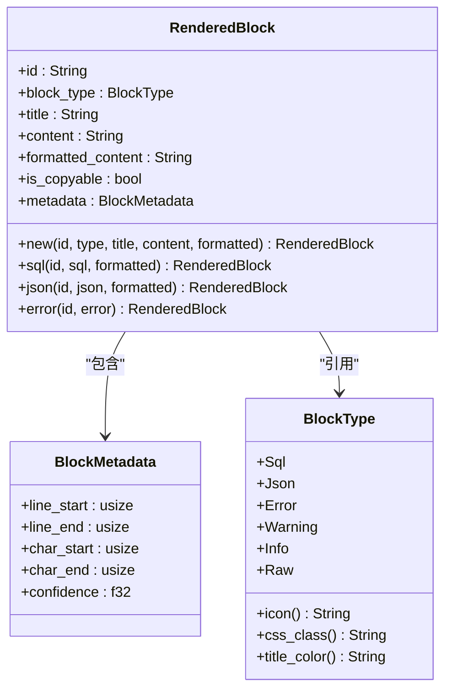
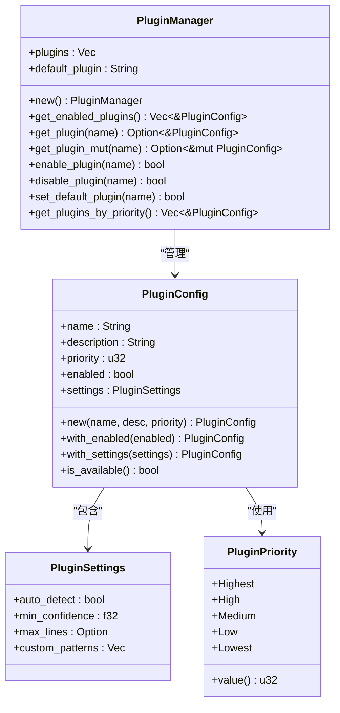
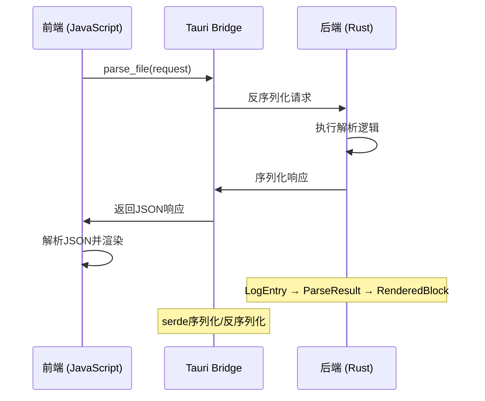

# 数据模型

<cite>
**Referenced Files in This Document**   
- [log_entry.rs](file://src-tauri/src/models/log_entry.rs)
- [parse_result.rs](file://src-tauri/src/models/parse_result.rs)
- [rendered_block.rs](file://src-tauri/src/models/rendered_block.rs)
- [plugin_config.rs](file://src-tauri/src/models/plugin_config.rs)
- [log_parser.rs](file://src-tauri/src/parser/log_parser.rs)
- [renderer.rs](file://src-tauri/src/parser/renderer.rs)
- [commands.rs](file://src-tauri/src/tauri/commands.rs)
- [Cargo.toml](file://src-tauri/Cargo.toml)
</cite>

## 目录
1. [日志条目模型](#日志条目模型)
2. [解析结果模型](#解析结果模型)
3. [渲染块模型](#渲染块模型)
4. [插件配置模型](#插件配置模型)
5. [数据序列化与通信](#数据序列化与通信)
6. [模型扩展指南](#模型扩展指南)

## 日志条目模型

`LogEntry` 结构体是日志解析系统的核心数据单元，用于表示单条日志记录的完整信息。该结构体在解析过程中遵循不可变性原则，一旦创建后其核心字段不会被修改，确保了数据的一致性和线程安全性。

结构体包含以下关键字段：
- **line_number**: 记录日志在原始文件中的行号，用于定位和引用
- **timestamp**: 可选的时间戳字段，使用 `Option<DateTime<Utc>>` 类型存储解析出的时间信息
- **level**: 日志级别，通过 `LogLevel` 枚举类型表示，支持 Debug、Info、Warn、Error 和 Unknown 五种级别
- **content**: 日志内容的标准化版本，可能经过清理和格式化处理
- **raw_line**: 原始日志行内容，保留了完整的未处理文本

`LogEntry` 在解析生命周期中扮演着起始点的角色。当文件被读取后，每一行文本首先被转换为 `LogEntry` 实例。该结构体提供了 `new` 构造函数，自动从日志内容中提取时间戳和日志级别。提取过程通过正则匹配和关键词识别实现，支持多种常见的时间戳格式和日志级别标识。

**Section sources**
- [log_entry.rs](file://src-tauri/src/models/log_entry.rs#L1-L137)

## 解析结果模型

`ParseResult` 结构体作为解析过程的输出容器，封装了单条日志条目的完整解析结果。它不仅包含原始日志数据，还聚合了处理过程中的各种元信息和统计指标。

主要组成部分包括：
- **original**: 对原始 `LogEntry` 的引用，保持数据溯源
- **rendered_blocks**: `RenderedBlock` 对象的集合，表示从日志中提取出的可渲染语义块
- **is_error** 和 **is_warning**: 布尔标志，标识日志是否包含错误或警告信息
- **stats**: `ParseStats` 结构体，记录解析过程的性能和质量指标

`ParseStats` 包含解析耗时（毫秒）、渲染块数量、平均置信度和解析成功状态等关键统计信息。这些数据对于性能监控和质量评估至关重要。`ParseResult` 提供了流式构建模式，通过 `add_block`、`add_blocks` 和 `with_stats` 等方法支持链式调用，便于在解析过程中逐步构建结果。

更高级的 `ParseResultSet` 结构体用于聚合多个 `ParseResult`，提供文件级别的总体统计信息，如总行数、成功解析行数、错误行数、警告行数和总解析时间等。这种分层设计实现了从单条日志到整体文件的统计信息聚合。

**Section sources**
- [parse_result.rs](file://src-tauri/src/models/parse_result.rs#L1-L285)

## 渲染块模型

`RenderedBlock` 结构体定义了前端可渲染的内容单元，将解析出的语义信息转换为用户友好的展示形式。每个渲染块代表日志中的一个有意义的组成部分，如 SQL 查询、JSON 数据或错误信息。

核心字段包括：
- **id**: 块的唯一标识符，用于前端组件的 key 绑定
- **block_type**: `BlockType` 枚举，标识块的语义类型（SQL、JSON、Error、Warning、Info、Raw）
- **title**: 块的显示标题
- **content**: 原始内容，用于复制操作
- **formatted_content**: 格式化后的内容，用于展示
- **is_copyable**: 布尔值，指示块内容是否可复制
- **metadata**: `BlockMetadata` 结构体，包含位置信息和置信度

`BlockMetadata` 提供了精确的定位信息，包括起始和结束行号、字符位置以及置信度评分（0.0-1.0）。这些元数据支持高级功能如文本高亮、折叠和上下文定位。`RenderedBlock` 提供了多种静态构造方法（如 `sql`、`json`、`error`），简化了不同类型块的创建过程。



**Diagram sources**
- [rendered_block.rs](file://src-tauri/src/models/rendered_block.rs#L1-L182)

**Section sources**
- [rendered_block.rs](file://src-tauri/src/models/rendered_block.rs#L1-L182)

## 插件配置模型

`PluginConfig` 结构体负责管理插件系统的配置参数，实现灵活的插件行为定制。该模型支持运行时配置调整，使用户能够根据具体需求优化解析行为。

主要配置项包括：
- **name**: 插件名称
- **description**: 插件描述
- **priority**: 插件优先级，数值越小优先级越高
- **enabled**: 启用状态开关
- **settings**: `PluginSettings` 对象，包含具体的行为参数

`PluginSettings` 包含以下可调参数：
- **auto_detect**: 是否启用自动检测功能
- **min_confidence**: 最小置信度阈值，低于此值的解析结果将被忽略
- **max_lines**: 最大处理行数限制，用于性能控制
- **custom_patterns**: 用户自定义的正则表达式模式列表

`PluginManager` 结构体管理所有插件的配置，提供插件的启用/禁用、优先级排序和默认插件设置等功能。系统预置了 Auto、MyBatis、JSON 和 Raw 等多种插件，每种插件针对特定的日志格式进行优化。



**Diagram sources**
- [plugin_config.rs](file://src-tauri/src/models/plugin_config.rs#L1-L190)

**Section sources**
- [plugin_config.rs](file://src-tauri/src/models/plugin_config.rs#L1-L190)

## 数据序列化与通信

数据模型通过 `serde` 序列化框架实现前后端之间的 IPC 通信。所有核心数据结构均派生了 `Serialize` 和 `Deserialize` 特性，使其能够高效地在 Rust 后端和前端 JavaScript 环境之间传输。

在 `Cargo.toml` 中，`serde` 和 `serde_json` 被列为关键依赖，确保了序列化功能的可用性。Tauri 框架利用这些特性将 Rust 结构体自动转换为 JSON 格式，通过命令系统进行跨语言调用。

`commands.rs` 文件定义了前后端通信的接口契约。例如，`parse_file` 命令接收 `ParseFileRequest` 并返回 `ParseFileResponse`，这些请求和响应结构体同样实现了序列化。这种设计确保了类型安全的通信，避免了手动 JSON 处理的错误。



**Diagram sources**
- [commands.rs](file://src-tauri/src/tauri/commands.rs#L1-L292)
- [Cargo.toml](file://src-tauri/Cargo.toml#L1-L55)

**Section sources**
- [commands.rs](file://src-tauri/src/tauri/commands.rs#L1-L292)
- [Cargo.toml](file://src-tauri/Cargo.toml#L1-L55)

## 模型扩展指南

当需要扩展数据模型时，应遵循以下版本兼容性原则：

1. **向后兼容的字段添加**：新增字段应使用 `Option<T>` 类型或提供合理的默认值，确保旧版本数据仍可正确反序列化。
2. **枚举扩展**：新增枚举变体时，应保留 `Unknown` 或类似兜底变体，避免反序列化失败。
3. **版本标记**：考虑在关键结构体中添加版本字段，便于处理跨版本的数据迁移。
4. **弃用策略**：避免直接删除字段，可先标记为弃用，经过几个版本后再移除。

例如，若要为 `LogEntry` 添加新的 `category` 字段，推荐实现方式为：
```rust
pub struct LogEntry {
    // ... existing fields
    pub category: Option<String>, // 使用Option确保兼容性
}
```

同时，应在文档中明确说明扩展的语义和使用场景，确保所有插件和前端组件能够正确处理新增字段。