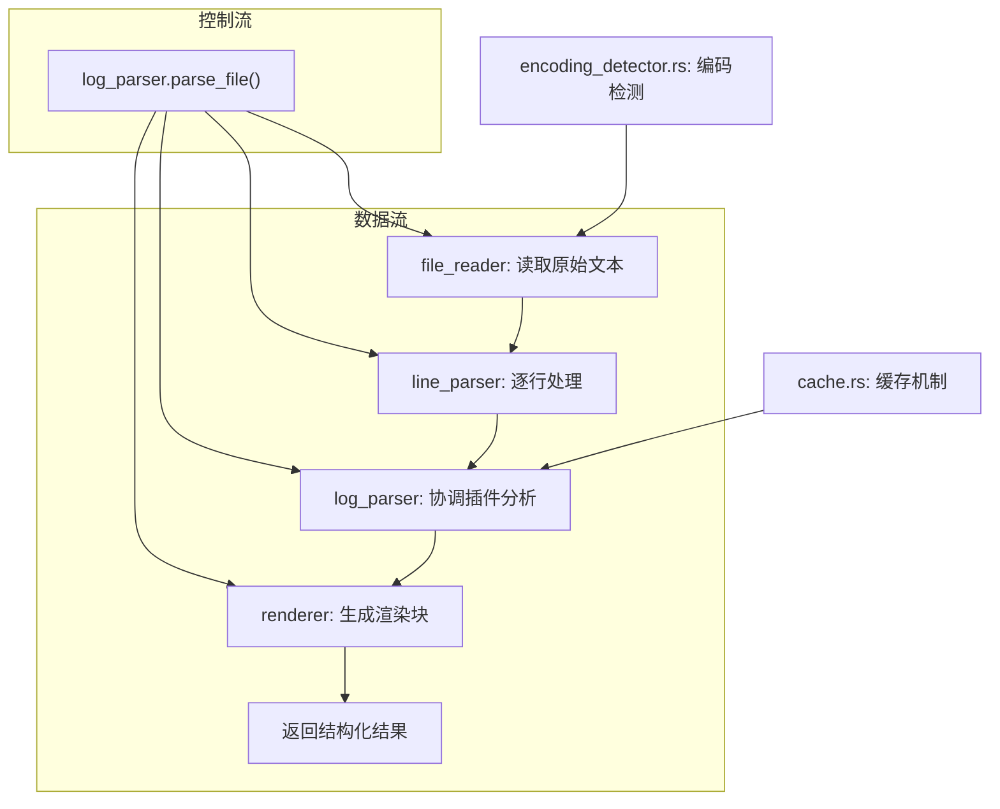

# 核心模块

<cite>
**Referenced Files in This Document**  
- [log_entry.rs](file://src-tauri/src/models/log_entry.rs)
- [parse_result.rs](file://src-tauri/src/models/parse_result.rs)
- [rendered_block.rs](file://src-tauri/src/models/rendered_block.rs)
- [file_reader.rs](file://src-tauri/src/parser/file_reader.rs)
- [line_parser.rs](file://src-tauri/src/parser/line_parser.rs)
- [log_parser.rs](file://src-tauri/src/parser/log_parser.rs)
- [renderer.rs](file://src-tauri/src/parser/renderer.rs)
- [cache.rs](file://src-tauri/src/parser/cache.rs)
- [encoding_detector.rs](file://src-tauri/src/utils/encoding_detector.rs)
- [mod.rs](file://src-tauri/src/models/mod.rs)
- [mod.rs](file://src-tauri/src/parser/mod.rs)
- [lib.rs](file://src-tauri/src/lib.rs)
</cite>

## 目录
1. [数据模型](#数据模型)
2. [解析管道工作流程](#解析管道工作流程)
3. [核心组件分析](#核心组件分析)
4. [模块依赖关系](#模块依赖关系)
5. [性能优化与最佳实践](#性能优化与最佳实践)

## 数据模型

### 日志条目 (LogEntry)
`LogEntry` 结构体是日志解析的基础数据单元，用于表示原始日志文件中的单行记录。它包含行号、时间戳、日志级别、内容和原始行内容等字段，为后续的语义分析提供原始数据。

**Section sources**
- [log_entry.rs](file://src-tauri/src/models/log_entry.rs#L3-L16)

### 解析结果 (ParseResult)
`ParseResult` 结构体封装了单条日志条目的完整解析结果。它不仅包含原始的 `LogEntry`，还包含由插件生成的渲染块列表、错误/警告标志以及详细的解析统计信息，是连接解析与渲染的关键中间数据结构。

**Section sources**
- [parse_result.rs](file://src-tauri/src/models/parse_result.rs#L4-L17)

### 渲染块 (RenderedBlock)
`RenderedBlock` 结构体定义了最终可渲染的UI组件。每个块具有唯一的ID、类型、标题、原始和格式化后的内容，以及元数据。这种结构化设计支持高亮、折叠、复制等交互功能，提升了日志的可读性。

**Section sources**
- [rendered_block.rs](file://src-tauri/src/models/rendered_block.rs#L2-L19)

## 解析管道工作流程



**Diagram sources**
- [log_parser.rs](file://src-tauri/src/parser/log_parser.rs#L7-L14)
- [file_reader.rs](file://src-tauri/src/parser/file_reader.rs#L7-L12)
- [line_parser.rs](file://src-tauri/src/parser/line_parser.rs#L4-L8)
- [renderer.rs](file://src-tauri/src/parser/renderer.rs#L5-L9)
- [cache.rs](file://src-tauri/src/parser/cache.rs#L4-L9)
- [encoding_detector.rs](file://src-tauri/src/utils/encoding_detector.rs)

**Section sources**
- [log_parser.rs](file://src-tauri/src/parser/log_parser.rs#L7-L14)
- [file_reader.rs](file://src-tauri/src/parser/file_reader.rs#L7-L12)
- [line_parser.rs](file://src-tauri/src/parser/line_parser.rs#L4-L8)
- [renderer.rs](file://src-tauri/src/parser/renderer.rs#L5-L9)

## 核心组件分析

### 文件读取器 (FileReader)
`FileReader` 负责安全、高效地从磁盘读取日志文件。它集成了 `EncodingDetector` 来自动识别文件编码，确保正确读取不同编码的日志文件。组件内置了文件类型验证和大小限制，防止处理不支持或过大的文件。

**Section sources**
- [file_reader.rs](file://src-tauri/src/parser/file_reader.rs#L7-L12)

### 行解析器 (LineParser)
`LineParser` 使用正则表达式模式库来提取每行日志的时间戳和级别。它实现了智能的多行日志合并逻辑，能将堆栈跟踪等跨行内容合并为单个 `LogEntry`。此外，它还包含关键词提取等辅助功能。

**Section sources**
- [line_parser.rs](file://src-tauri/src/parser/line_parser.rs#L4-L8)

### 日志解析器 (LogParser)
`LogParser` 是整个解析流程的协调中心。它按顺序调用 `FileReader`、`LineParser` 和 `RenderEngine`，并集成 `ParseCache` 实现结果缓存。其 `parse_file` 方法是外部调用的主要入口点。

**Section sources**
- [log_parser.rs](file://src-tauri/src/parser/log_parser.rs#L7-L14)

### 渲染引擎 (RenderEngine)
`RenderEngine` 通过 `PluginRegistry` 调用插件对 `LogEntry` 进行语义分析。它负责创建 `ParseResult` 并收集性能统计信息，是插件系统与核心解析逻辑的桥梁。

**Section sources**
- [renderer.rs](file://src-tauri/src/parser/renderer.rs#L5-L9)

### 缓存机制 (ParseCache)
`ParseCache` 使用 `RwLock<HashMap>` 实现线程安全的内存缓存。它通过文件路径和插件名生成缓存键，采用简单的LRU策略管理缓存大小，显著提升了重复解析的性能。

**Section sources**
- [cache.rs](file://src-tauri/src/parser/cache.rs#L4-L9)

### 编码检测 (EncodingDetector)
`EncodingDetector` 利用 `encoding_rs` 库检测文件编码。它通过检查BOM、计算解码置信度并分析文本特征（如中文字符、日志关键词）来确定最可能的编码，确保文件被正确读取。

**Section sources**
- [encoding_detector.rs](file://src-tauri/src/utils/encoding_detector.rs)

## 模块依赖关系

```mermaid
classDiagram
    class LogParser {
        +file_reader: FileReader
        +line_parser: LineParser
        +render_engine: RenderEngine
        +cache: ParseCache
    }
    
    class FileReader {
        +