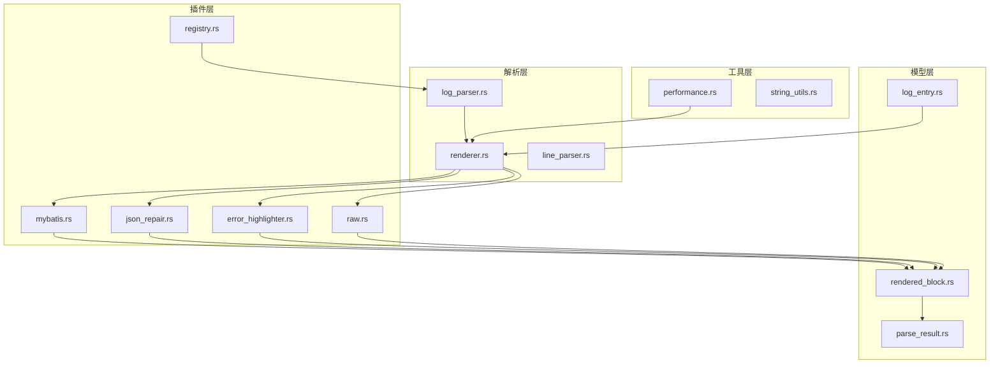
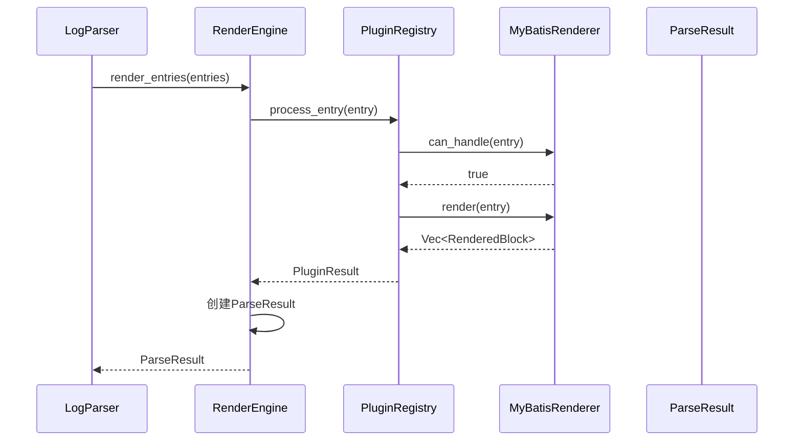
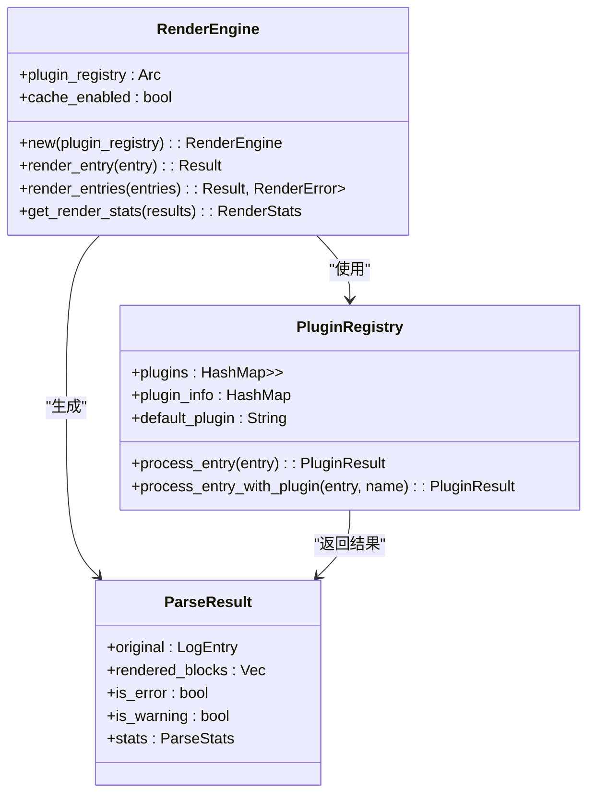
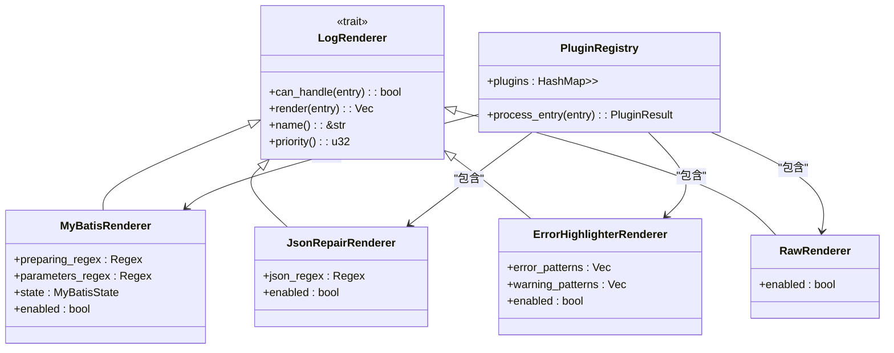
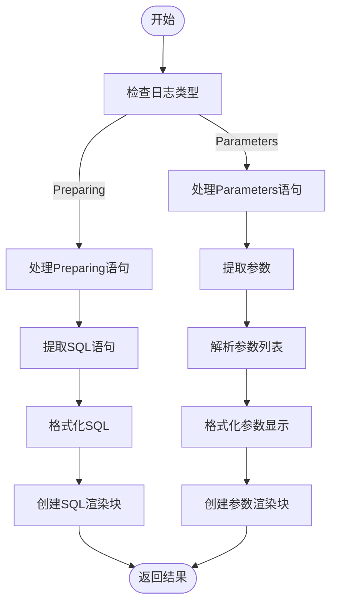
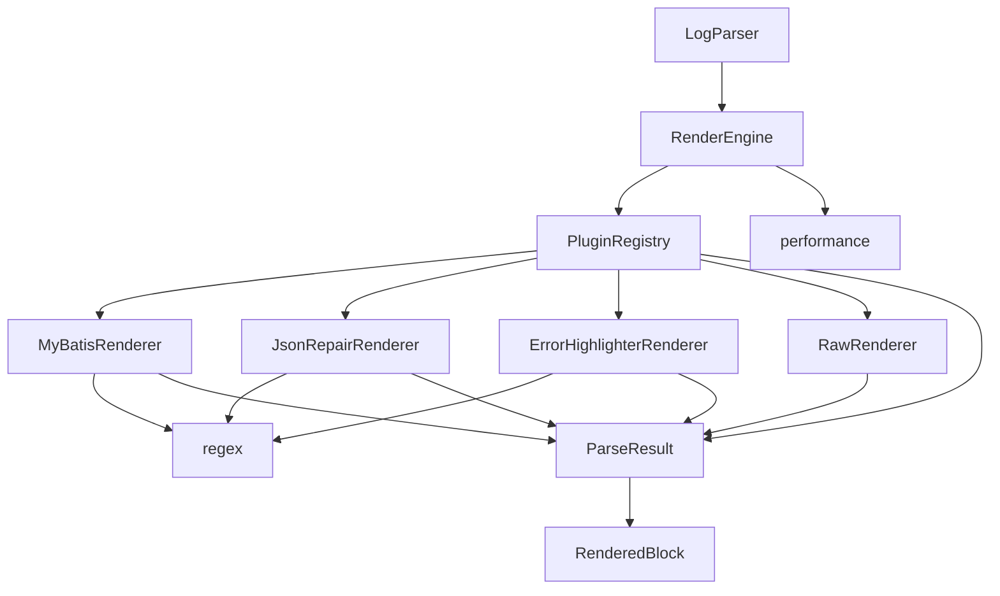
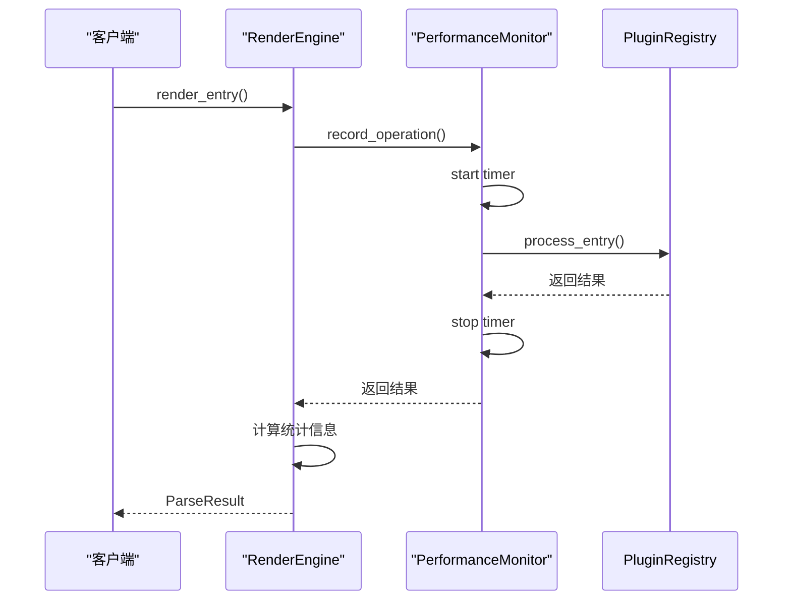

# 渲染引擎

<cite>
**Referenced Files in This Document**   
- [renderer.rs](file://src-tauri/src/parser/renderer.rs)
- [parse_result.rs](file://src-tauri/src/models/parse_result.rs)
- [rendered_block.rs](file://src-tauri/src/models/rendered_block.rs)
- [performance.rs](file://src-tauri/src/utils/performance.rs)
- [registry.rs](file://src-tauri/src/plugins/registry.rs)
- [mybatis.rs](file://src-tauri/src/plugins/mybatis.rs)
- [log_entry.rs](file://src-tauri/src/models/log_entry.rs)
- [log_parser.rs](file://src-tauri/src/parser/log_parser.rs)
</cite>

## 目录
1. [简介](#简介)
2. [项目结构](#项目结构)
3. [核心组件](#核心组件)
4. [架构概述](#架构概述)
5. [详细组件分析](#详细组件分析)
6. [依赖分析](#依赖分析)
7. [性能考量](#性能考量)
8. [故障排除指南](#故障排除指南)
9. [结论](#结论)

## 简介

本文件详细描述了日志解析系统中的渲染引擎工作原理与实现细节。该系统旨在将原始日志条目转换为结构化、可交互的HTML渲染块，支持多种可视化效果和性能优化策略。渲染引擎作为系统的核心组件，负责协调各类插件对日志内容进行语义分析和格式转换，最终生成前端可消费的富文本输出。

## 项目结构

日志渲染系统采用模块化设计，主要分为模型层、解析层、插件层和工具层。各层职责分明，通过清晰的接口进行交互。

**Diagram sources**
- [log_entry.rs](file://src-tauri/src/models/log_entry.rs)
- [rendered_block.rs](file://src-tauri/src/models/rendered_block.rs)
- [parse_result.rs](file://src-tauri/src/models/parse_result.rs)
- [log_parser.rs](file://src-tauri/src/parser/log_parser.rs)
- [renderer.rs](file://src-tauri/src/parser/renderer.rs)
- [mybatis.rs](file://src-tauri/src/plugins/mybatis.rs)
- [json_repair.rs](file://src-tauri/src/plugins/json_repair.rs)
- [error_highlighter.rs](file://src-tauri/src/plugins/error_highlighter.rs)
- [raw.rs](file://src-tauri/src/plugins/raw.rs)
- [registry.rs](file://src-tauri/src/plugins/registry.rs)
- [performance.rs](file://src-tauri/src/utils/performance.rs)

**Section sources**
- [src-tauri/src/models/mod.rs](file://src-tauri/src/models/mod.rs)
- [src-tauri/src/parser/mod.rs](file://src-tauri/src/parser/mod.rs)
- [src-tauri/src/plugins/mod.rs](file://src-tauri/src/plugins/mod.rs)

## 核心组件

渲染引擎系统由多个核心组件构成，包括渲染引擎主控器、插件注册中心、渲染块模型、解析结果模型以及性能监控工具。这些组件协同工作，实现了从原始日志到结构化渲染块的完整转换流程。

**Section sources**
- [renderer.rs](file://src-tauri/src/parser/renderer.rs#L5-L9)
- [registry.rs](file://src-tauri/src/plugins/registry.rs#L8-L13)
- [rendered_block.rs](file://src-tauri/src/models/rendered_block.rs#L2-L19)
- [parse_result.rs](file://src-tauri/src/models/parse_result.rs#L4-L17)
- [performance.rs](file://src-tauri/src/utils/performance.rs#L5-L12)

## 架构概述

系统采用插件化架构设计，以渲染引擎为核心，通过插件注册中心管理各类日志渲染插件。当接收到日志条目时，渲染引擎委托插件注册中心选择合适的插件进行处理，最终生成包含丰富语义信息的渲染结果。

**Diagram sources**
- [log_parser.rs](file://src-tauri/src/parser/log_parser.rs#L100-L120)
- [renderer.rs](file://src-tauri/src/parser/renderer.rs#L50-L70)
- [registry.rs](file://src-tauri/src/plugins/registry.rs#L150-L180)
- [mybatis.rs](file://src-tauri/src/plugins/mybatis.rs#L100-L120)

## 详细组件分析

### 渲染引擎分析

渲染引擎作为系统的核心调度器，负责协调插件注册中心处理日志条目，并将处理结果封装为解析结果。它提供了同步和异步的渲染接口，支持单个条目和批量条目的渲染操作。

#### 渲染引擎类图

**Diagram sources**
- [renderer.rs](file://src-tauri/src/parser/renderer.rs#L5-L9)
- [registry.rs](file://src-tauri/src/plugins/registry.rs#L8-L13)
- [parse_result.rs](file://src-tauri/src/models/parse_result.rs#L4-L17)

**Section sources**
- [renderer.rs](file://src-tauri/src/parser/renderer.rs#L5-L241)

### 插件系统分析

插件系统采用策略模式实现，通过`LogRenderer` trait定义统一接口，各类具体插件实现该接口以提供特定的日志解析功能。插件注册中心负责插件的生命周期管理和调度决策。

#### 插件系统类图

**Diagram sources**
- [trait_def.rs](file://src-tauri/src/plugins/trait_def.rs#L2-L43)
- [mybatis.rs](file://src-tauri/src/plugins/mybatis.rs#L4-L10)
- [json_repair.rs](file://src-tauri/src/plugins/json_repair.rs#L5-L9)
- [error_highlighter.rs](file://src-tauri/src/plugins/error_highlighter.rs#L4-L9)
- [raw.rs](file://src-tauri/src/plugins/raw.rs#L3-L6)
- [registry.rs](file://src-tauri/src/plugins/registry.rs#L8-L13)

**Section sources**
- [trait_def.rs](file://src-tauri/src/plugins/trait_def.rs#L2-L43)
- [mybatis.rs](file://src-tauri/src/plugins/mybatis.rs#L4-L333)
- [json_repair.rs](file://src-tauri/src/plugins/json_repair.rs#L5-L9)
- [error_highlighter.rs](file://src-tauri/src/plugins/error_highlighter.rs#L4-L9)
- [raw.rs](file://src-tauri/src/plugins/raw.rs#L3-L6)

### MyBatis插件分析

MyBatis插件专门用于解析MyBatis框架生成的日志，能够识别"Preparing"和"Parameters"语句，并将它们合并为完整的SQL查询。该插件实现了复杂的参数替换逻辑，能够智能判断参数类型并进行适当的格式化。

#### MyBatis插件处理流程

**Diagram sources**
- [mybatis.rs](file://src-tauri/src/plugins/mybatis.rs#L100-L150)

**Section sources**
- [mybatis.rs](file://src-tauri/src/plugins/mybatis.rs#L4-L333)

## 依赖分析

系统各组件之间存在明确的依赖关系，形成了清晰的调用链路。渲染引擎依赖插件注册中心，插件注册中心又依赖具体的渲染插件实现。

**Diagram sources**
- [log_parser.rs](file://src-tauri/src/parser/log_parser.rs#L10-L20)
- [renderer.rs](file://src-tauri/src/parser/renderer.rs#L5-L9)
- [registry.rs](file://src-tauri/src/plugins/registry.rs#L8-L13)
- [mybatis.rs](file://src-tauri/src/plugins/mybatis.rs#L4-L10)
- [json_repair.rs](file://src-tauri/src/plugins/json_repair.rs#L5-L9)
- [error_highlighter.rs](file://src-tauri/src/plugins/error_highlighter.rs#L4-L9)
- [raw.rs](file://src-tauri/src/plugins/raw.rs#L3-L6)
- [performance.rs](file://src-tauri/src/utils/performance.rs#L5-L12)

**Section sources**
- [Cargo.toml](file://src-tauri/Cargo.toml)

## 性能考量

系统内置了完善的性能监控机制，通过`PerformanceMonitor`和`MemoryTracker`工具对关键操作进行计时和内存使用跟踪。渲染引擎在每次处理日志条目时都会记录耗时，并生成详细的性能统计报告。

### 性能监控机制

**Diagram sources**
- [renderer.rs](file://src-tauri/src/parser/renderer.rs#L50-L70)
- [performance.rs](file://src-tauri/src/utils/performance.rs#L5-L12)

**Section sources**
- [performance.rs](file://src-tauri/src/utils/performance.rs#L5-L175)

## 故障排除指南

当渲染引擎出现问题时，可以通过检查以下方面进行故障排除：

1. **插件状态**：确认相关插件是否已正确注册并启用
2. **正则表达式**：检查插件使用的正则表达式是否能正确匹配日志内容
3. **内存使用**：监控系统内存使用情况，避免内存溢出
4. **性能瓶颈**：使用性能监控工具定位耗时较长的操作

**Section sources**
- [renderer.rs](file://src-tauri/src/parser/renderer.rs#L171-L182)
- [parse_result.rs](file://src-tauri/src/models/parse_result.rs#L100-L120)
- [performance.rs](file://src-tauri/src/utils/performance.rs#L50-L70)

## 结论

日志渲染引擎通过插件化架构实现了高度的可扩展性和灵活性。系统采用清晰的分层设计，各组件职责分明，通过标准化接口进行交互。富文本生成策略结合了关键词高亮、语法着色等视觉效果，提升了日志的可读性。性能监控机制为系统优化提供了数据支持，而插件系统则允许用户根据需要扩展功能。整体设计