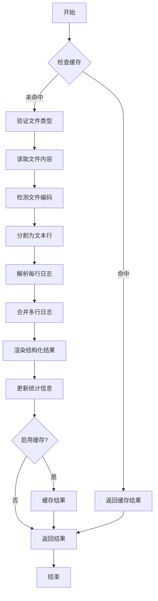
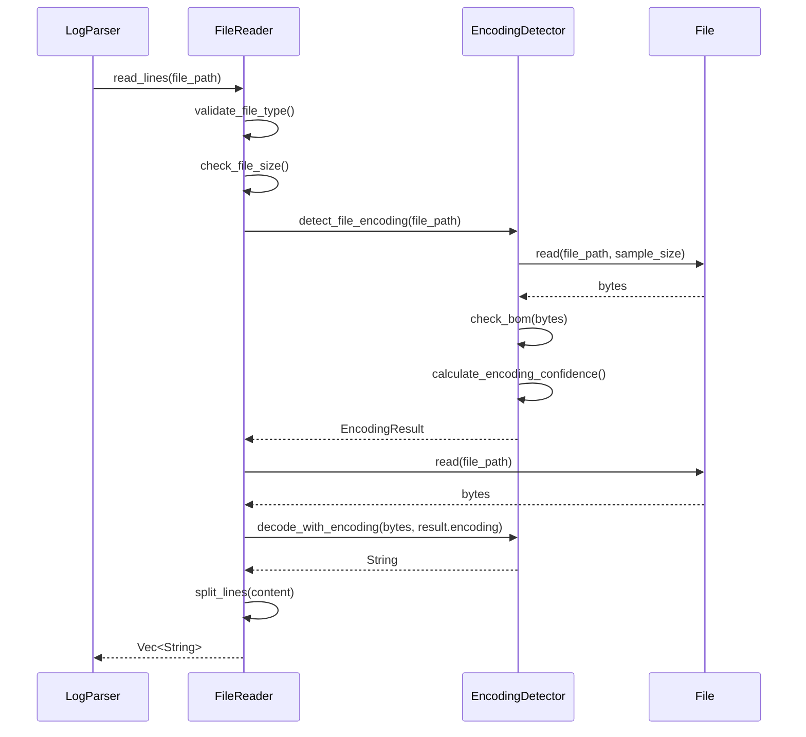
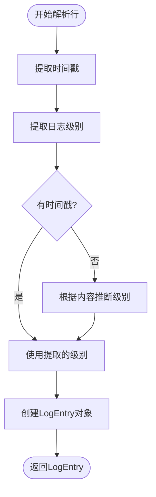
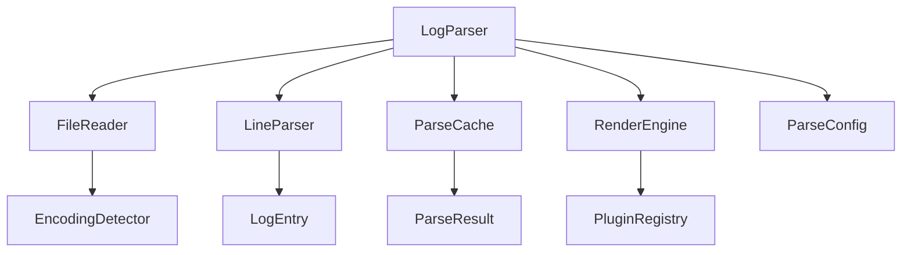

<cite>
**本文档中引用的文件**   
- [log_parser.rs](file://src-tauri/src/parser/log_parser.rs)
- [file_reader.rs](file://src-tauri/src/parser/file_reader.rs)
- [encoding_detector.rs](file://src-tauri/src/utils/encoding_detector.rs)
- [line_parser.rs](file://src-tauri/src/parser/line_parser.rs)
- [log_entry.rs](file://src-tauri/src/models/log_entry.rs)
- [parse_result.rs](file://src-tauri/src/models/parse_result.rs)
- [cache.rs](file://src-tauri/src/parser/cache.rs)
- [performance.rs](file://src-tauri/src/utils/performance.rs)
</cite>

## 目录
1. [解析引擎](#解析引擎)
2. [核心组件](#核心组件)
3. [架构概述](#架构概述)
4. [详细组件分析](#详细组件分析)
5. [依赖分析](#依赖分析)
6. [性能考虑](#性能考虑)
7. [故障排除指南](#故障排除指南)
8. [结论](#结论)

## 解析引擎
log-whisper的解析引擎是一个模块化、高性能的日志处理系统，旨在高效地解析大型日志文件。该引擎通过协调多个专用组件，实现了从文件读取到结构化输出的完整解析流程。其核心设计原则包括流式处理以支持大文件、自动编码检测以确保文本正确性，以及灵活的插件系统以适应不同的日志格式。解析引擎能够处理常见的日志级别（如INFO、ERROR）和时间戳格式，并通过合并策略正确处理多行日志条目（如异常堆栈）。整个过程被设计为可配置和可监控的，支持缓存以提升重复解析的性能，并提供详细的统计信息用于分析和优化。

## 核心组件
解析引擎由四个核心组件构成：`LogParser`作为主控制器协调整个解析流程；`FileReader`负责安全地读取文件内容；`EncodingDetector`自动识别文件的字符编码；`LineParser`则将原始文本行解析为结构化的日志条目。这些组件通过清晰的接口进行交互，确保了系统的高内聚和低耦合。`LogParser`利用`FileReader`获取文件行，`FileReader`在内部调用`EncodingDetector`来正确解码文件内容。随后，`LogParser`将文本行传递给`LineParser`进行结构化处理。此外，`LogParser`还集成了`ParseCache`以缓存解析结果，并使用`RenderEngine`通过插件系统对日志进行渲染和增强。这种分层架构使得每个组件可以独立开发、测试和优化。

**Section sources**
- [log_parser.rs](file://src-tauri/src/parser/log_parser.rs#L1-L246)
- [file_reader.rs](file://src-tauri/src/parser/file_reader.rs#L1-L200)
- [encoding_detector.rs](file://src-tauri/src/utils/encoding_detector.rs#L1-L276)
- [line_parser.rs](file://src-tauri/src/parser/line_parser.rs#L1-L245)

## 架构概述
解析引擎的架构是一个典型的流水线设计，数据从文件源流向最终的结构化结果。该流程始于`LogParser`接收一个文件路径，然后依次经过文件验证、缓存检查、文件读取、编码检测、行解析、多行合并和结果渲染等阶段。每个阶段都由专门的组件负责，确保了职责的单一性。该架构支持同步、异步和流式三种解析模式，以适应不同的使用场景。异步模式适用于需要非阻塞操作的GUI应用，而流式模式则允许在解析过程中逐步处理结果，这对于实时日志监控至关重要。整个流程被设计为可配置的，用户可以通过`ParseConfig`对象控制最大文件大小、是否启用缓存等参数。

**Diagram sources**
- [log_parser.rs](file://src-tauri/src/parser/log_parser.rs#L50-L240)
- [file_reader.rs](file://src-tauri/src/parser/file_reader.rs#L50-L150)
- [encoding_detector.rs](file://src-tauri/src/utils/encoding_detector.rs#L50-L200)
- [line_parser.rs](file://src-tauri/src/parser/line_parser.rs#L50-L200)

## 详细组件分析

### LogParser分析
`LogParser`是解析引擎的主控制器，负责协调所有其他组件完成端到端的解析任务。它提供了`parse_file`、`parse_file_sync`和`parse_file_stream`三个主要接口，分别支持异步、同步和流式解析。在解析开始时，`LogParser`首先验证文件类型，确保只处理`.log`和`.txt`文件。接着，它会检查`ParseCache`以查看是否已有缓存结果，这可以显著提升重复解析的性能。如果缓存未命中，`LogParser`会调用`FileReader`来获取文件内容。解析完成后，结果会被传递给`RenderEngine`进行渲染，并根据配置决定是否将结果存入缓存。`LogParser`还负责收集和汇总整个解析过程的统计信息，如总耗时和解析成功率。

**Section sources**
- [log_parser.rs](file://src-tauri/src/parser/log_parser.rs#L1-L246)

### FileReader与EncodingDetector分析
`FileReader`和`EncodingDetector`协同工作，确保日志文件被正确读取和解码。`FileReader`首先检查文件是否存在及其大小，防止解析过大的文件导致内存问题。然后，它调用`EncodingDetector`的`read_file_with_encoding`方法。`EncodingDetector`通过分析文件的字节序标记（BOM）和样本数据来推断编码。它支持UTF-8、GBK、GB18030等多种编码，并通过计算解码置信度来选择最合适的编码。检测到编码后，`EncodingDetector`会将文件内容正确解码为UTF-8字符串，然后由`FileReader`将其按行分割并返回。这种设计确保了即使在编码未知或混合的环境中，日志内容也能被准确地解析。

**Diagram sources**
- [file_reader.rs](file://src-tauri/src/parser/file_reader.rs#L50-L150)
- [encoding_detector.rs](file://src-tauri/src/utils/encoding_detector.rs#L50-L200)

### LineParser分析
`LineParser`负责将原始文本行转换为结构化的`LogEntry`对象。它使用预定义的正则表达式模式来匹配时间戳和日志级别。`timestamp_patterns`数组包含了多种常见的时间戳格式，如ISO 8601和Spring Boot格式。`level_patterns`数组则用于识别INFO、ERROR等日志级别。`LineParser`首先尝试从行中提取时间戳和级别，如果失败，则会根据行内容中的关键词（如"error"、"exception"）进行推断。`merge_multiline_logs`方法是处理多行日志的关键，它通过检查每行是否包含时间戳和级别来判断其是新日志的开始还是前一条日志的延续。如果一行不包含这些标识，则被视为前一条日志的延续，并被合并到前一个`LogEntry`的内容中。

**Diagram sources**
- [line_parser.rs](file://src-tauri/src/parser/line_parser.rs#L50-L200)
- [log_entry.rs](file://src-tauri/src/models/log_entry.rs#L1-L50)

## 依赖分析
解析引擎的组件间依赖关系清晰且单向，形成了一个稳定的调用链。`LogParser`是顶层组件，它直接依赖于`FileReader`、`LineParser`、`ParseCache`和`RenderEngine`。`FileReader`依赖于`EncodingDetector`来处理文件编码，而`RenderEngine`又依赖于`PluginRegistry`来管理插件。`LineParser`本身是独立的，不依赖其他解析组件。这种设计避免了循环依赖，使得组件可以独立测试。例如，`FileReader`可以在不启动整个`LogParser`的情况下进行单元测试。外部依赖主要通过`tokio`进行异步文件操作，通过`encoding_rs`库进行编码检测，以及通过`regex`和`chrono`库进行文本和时间处理。

**Diagram sources**
- [log_parser.rs](file://src-tauri/src/parser/log_parser.rs#L1-L246)
- [file_reader.rs](file://src-tauri/src/parser/file_reader.rs#L1-L200)
- [encoding_detector.rs](file://src-tauri/src/utils/encoding_detector.rs#L1-L276)
- [line_parser.rs](file://src-tauri/src/parser/line_parser.rs#L1-L245)
- [cache.rs](file://src-tauri/src/parser/cache.rs#L1-L193)
- [parse_result.rs](file://src-tauri/src/models/parse_result.rs#L1-L285)

## 性能考虑
解析引擎在设计时充分考虑了性能因素。对于大文件，流式处理模式（`parse_file_stream`）避免了将整个文件加载到内存中，从而支持解析远超内存大小的日志文件。`ParseCache`通过缓存解析结果，使得对同一文件的重复解析可以瞬间完成。`EncodingDetector`通过只读取文件的前8KB样本进行编码检测，而不是加载整个文件，大大提高了检测效率。正则表达式模式在`LineParser`初始化时被编译并缓存，避免了在解析每行时重复编译。性能监控功能（通过`PerformanceMonitor`和`MemoryTracker`）可以跟踪解析速度和内存使用情况，帮助用户识别性能瓶颈。建议的性能调优包括：根据实际文件大小调整`max_file_size`，在不需要时禁用缓存以节省内存，以及为已知编码的文件配置特定的解析器以跳过编码检测。

**Section sources**
- [performance.rs](file://src-tauri/src/utils/performance.rs#L1-L175)
- [log_parser.rs](file://src-tauri/src/parser/log_parser.rs#L50-L100)
- [file_reader.rs](file://src-tauri/src/parser/file_reader.rs#L50-L100)

## 故障排除指南
当解析过程出现问题时，应首先检查日志输出以获取详细信息。常见的错误包括文件不存在、文件过大或编码不支持。`ParseError`枚举定义了多种错误类型，如`FileReadError`和`ParseError`，可以帮助快速定位问题。如果日志级别或时间戳未被正确识别，可以检查`LineParser`中的正则表达式模式是否覆盖了日志的格式。对于多行日志合并错误，应验证日志的续行是否确实不包含时间戳和级别标识。如果遇到性能问题，可以启用性能监控来分析耗时最长的阶段。缓存问题可以通过调用`clear_cache`方法来解决。最后，确保`ParseConfig`中的配置参数（如`max