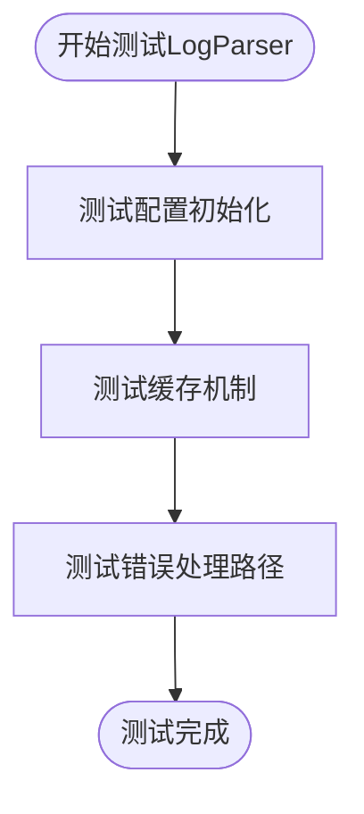
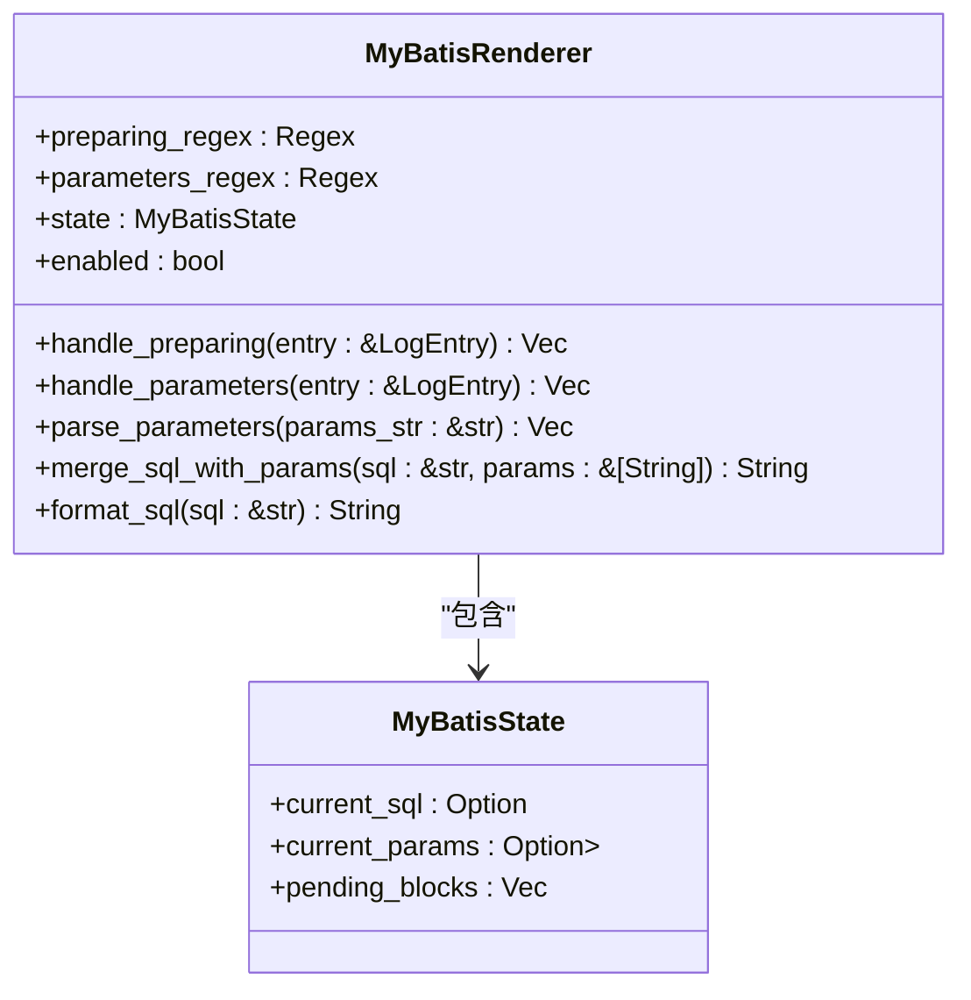
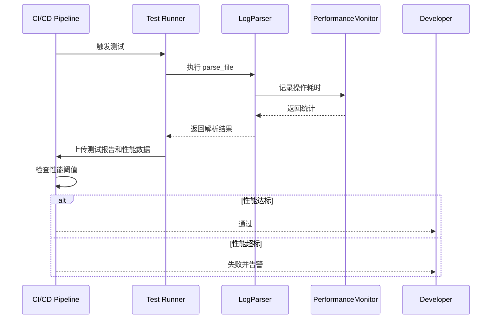

# 测试策略

<cite>
**本文档引用的文件**
- [parse_workflow_test.rs](file://tests/integration/parse_workflow_test.rs)
- [log_parser.rs](file://src-tauri/src/parser/log_parser.rs)
- [mybatis.rs](file://src-tauri/src/plugins/mybatis.rs)
- [log_entry.rs](file://src-tauri/src/models/log_entry.rs)
- [performance.rs](file://src-tauri/src/utils/performance.rs)
</cite>

## 目录
1. [引言](#引言)
2. [集成测试覆盖范围](#集成测试覆盖范围)
3. [单元测试补充建议](#单元测试补充建议)
4. [测试数据设计原则](#测试数据设计原则)
5. [测试自动化方案](#测试自动化方案)
6. [测试调试与问题定位](#测试调试与问题定位)
7. [结论](#结论)

## 引言
本测试策略文档旨在为 log-whisper 项目建立全面、可维护的测试体系，确保系统功能正确性与长期稳定性。文档分析当前集成测试的覆盖情况，提出对关键模块的单元测试补充建议，规范测试数据设计，并规划自动化测试与性能监控机制，帮助开发团队高效验证功能、快速定位问题。

## 集成测试覆盖范围
当前的集成测试主要集中在 `tests/integration/parse_workflow_test.rs` 文件中，通过多个异步测试用例对日志解析的完整工作流进行端到端验证。

测试用例覆盖了以下核心场景：
- **完整解析流程**：`test_full_parse_workflow` 验证了从文件读取、日志条目解析、多行合并到结果渲染的整个流程，确保解析器能正确处理混合日志级别和结构的日志内容。
- **插件功能验证**：`test_mybatis_plugin_parsing` 和 `test_json_plugin_parsing` 分别验证了 MyBatis 和 JSON 插件能否正确识别并渲染 SQL 语句和 JSON 数据块。
- **错误与警告识别**：`test_error_highlighting` 确保系统能准确标记包含 "ERROR" 和 "WARN" 的日志条目。
- **大文件处理能力**：`test_large_file_handling` 模拟了对包含 1000 行日志的大文件的解析，验证了系统的可扩展性。
- **文件验证逻辑**：`test_file_validation` 测试了对不存在文件和不支持文件类型的处理，确保输入验证的健壮性。

这些集成测试有效地验证了系统在真实使用场景下的行为，但主要集中在功能层面，对内部模块的隔离测试和边界条件的覆盖仍有提升空间。

**Section sources**
- [parse_workflow_test.rs](file://tests/integration/parse_workflow_test.rs#L1-L184)

## 单元测试补充建议
为了提高代码质量和可维护性，建议为关键模块补充单元测试，使用 mock 对象隔离外部依赖，实现更精细的测试覆盖。

### log_parser 模块
`src-tauri/src/parser/log_parser.rs` 中的 `LogParser` 是核心解析器，建议为其添加单元测试，重点关注：
- **配置初始化**：验证 `new()` 和 `with_config()` 方法是否正确设置默认值和自定义配置。
- **缓存机制**：使用 mock 缓存对象，测试 `enable_cache`、`disable_cache` 和 `clear_cache` 方法的行为，以及解析时缓存的命中与未命中逻辑。
- **错误处理路径**：模拟文件读取失败、解析异常等场景，验证错误能被正确捕获并返回 `ParseError`。

**Diagram sources**
- [log_parser.rs](file://src-tauri/src/parser/log_parser.rs#L1-L247)

**Section sources**
- [log_parser.rs](file://src-tauri/src/parser/log_parser.rs#L1-L247)

### MyBatis 插件
`src-tauri/src/plugins/mybatis.rs` 中的 `MyBatisRenderer` 是一个复杂的插件，建议进行深入的单元测试：
- **正则表达式匹配**：验证 `preparing_regex` 和 `parameters_regex` 能正确匹配各种格式的 SQL 和参数日志。
- **参数解析逻辑**：测试 `parse_parameters` 方法对带引号、逗号分隔、类型后缀（如 `(String)`）的参数字符串的解析准确性。
- **SQL 合并与格式化**：验证 `merge_sql_with_params` 能正确将参数替换到 SQL 的 `?` 占位符中，并测试 `format_sql` 对 SQL 关键字的换行和格式化效果。

**Diagram sources**
- [mybatis.rs](file://src-tauri/src/plugins/mybatis.rs#L1-L334)

**Section sources**
- [mybatis.rs](file://src-tauri/src/plugins/mybatis.rs#L1-L334)

## 测试数据设计原则
高质量的测试数据是确保测试有效性的关键。建议遵循以下原则设计测试数据：

- **典型日志样本**：使用项目 `data/pod.txt` 中的真实日志作为基准测试数据，确保系统能处理生产环境中的实际日志格式。
- **边界情况**：
  - **空文件**：测试解析器对空文件的处理，应返回空结果集或适当的错误。
  - **超大文件**：除了集成测试中的 1000 行，还应测试接近或超过 `max_file_size` 限制的文件，验证内存使用和性能表现。
  - **单行文件**：测试仅包含一行日志的文件。
- **异常输入**：
  - **格式错误的日志**：包含不完整时间戳、错误级别拼写、乱码字符的日志行。
  - **特殊字符**：包含换行符、制表符、Unicode 字符的日志内容。
  - **极端参数**：MyBatis 插件测试中，使用包含大量参数、嵌套引号、特殊 SQL 语法的参数字符串。

## 测试自动化方案
为确保代码质量的持续保障，建议实施以下自动化测试方案：

### CI/CD 集成
在 CI/CD 流水线（如 GitHub Actions）中集成测试执行：
- **触发条件**：在 `push` 到主分支和 `pull_request` 时自动运行测试。
- **执行命令**：使用 `scripts/test.sh` 或 `cargo test` 命令执行所有测试。
- **测试报告**：生成测试覆盖率报告（使用 `cargo tarpaulin` 或 `grcov`），并集成到代码审查流程中。

### 性能基准测试
利用 `src-tauri/src/utils/performance.rs` 中的 `PerformanceMonitor` 组件，建立性能基准测试：
- **监控解析速度**：定期运行对标准大文件的解析测试，记录 `total_parse_time_ms`，监控性能变化。
- **内存使用监控**：使用 `MemoryTracker` 记录峰值内存使用量，防止内存泄漏。
- **性能回归警报**：当解析时间或内存使用量超过预设阈值时，CI 流水线应失败并发出警报。

**Diagram sources**
- [performance.rs](file://src-tauri/src/utils/performance.rs#L1-L175)

**Section sources**
- [performance.rs](file://src-tauri/src/utils/performance.rs#L1-L175)

## 测试调试与问题定位
当测试失败时，高效的调试技巧至关重要：

### 日志追踪
- **启用详细日志**：在测试中设置 `RUST_LOG=debug` 或 `trace`，利用 `log` crate 输出的 `info!`、`debug!` 和 `trace!` 信息，追踪代码执行路径。
- **关键点日志**：在 `log_parser.rs` 的 `parse_file` 方法中，每个主要步骤（文件读取、行解析、合并、渲染）都有详细的日志输出，是定位问题的第一手资料。

### 断言验证技巧
- **分步断言**：不要只在最后断言最终结果。在 `test_full_parse_workflow` 中，先断言 `result.is_ok()`，再断言 `results.len()`，最后验证特定条目，能快速定位失败环节。
- **使用 `assert_eq!` 和 `assert_ne!`**：对于期望值明确的场景，使用 `assert_eq!` 提供更清晰的失败信息。
- **利用 `dbg!` 宏**：在本地调试时，临时插入 `dbg!(&variable)` 可以快速打印变量值和位置信息。

## 结论
本测试策略文档为 log-whisper 项目提供了全面的测试指导。通过加强单元测试、规范测试数据、实施自动化和性能监控，可以显著提升系统的稳定性和开发效率。建议开发团队遵循此策略，持续完善测试覆盖，确保 log-whisper 在各种场景下都能可靠运行。