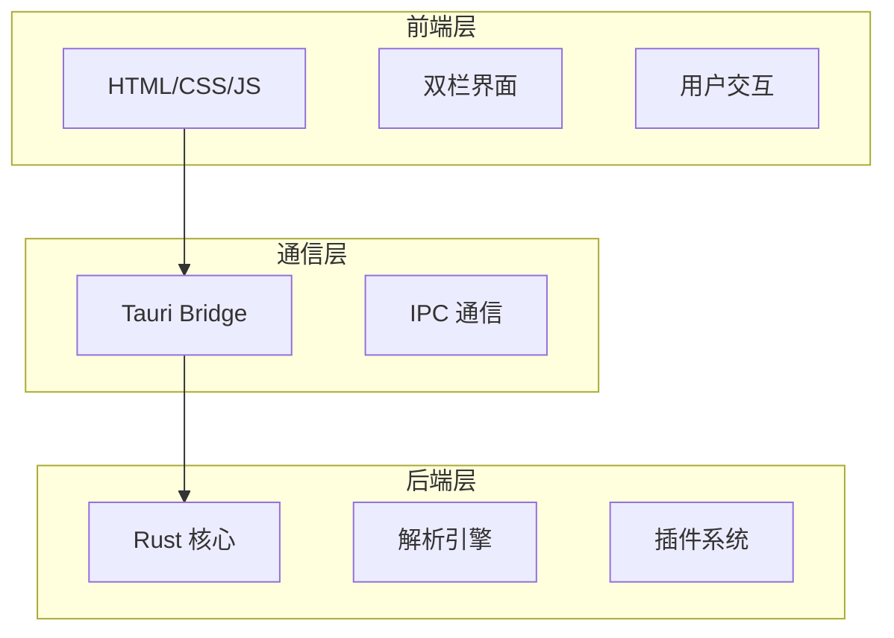
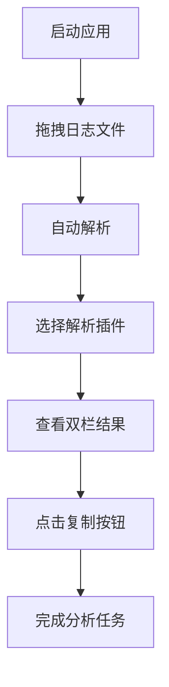

# 项目概述

<cite>
**本文档引用文件**  
- [README.md](file://README.md)
- [Cargo.toml](file://Cargo.toml)
- [package.json](file://package.json)
- [tauri.conf.json](file://src-tauri/tauri.conf.json)
- [需求.md](file://doc/需求.md)
- [产品设计文档.md](file://doc/产品设计文档.md)
- [技术方案文档.md](file://doc/技术方案文档.md)
- [log_parser.rs](file://src-tauri/src/parser/log_parser.rs)
- [commands.rs](file://src-tauri/src/tauri/commands.rs)
- [trait_def.rs](file://src-tauri/src/plugins/trait_def.rs)
- [mybatis.rs](file://src-tauri/src/plugins/mybatis.rs)
- [json_repair.rs](file://src-tauri/src/plugins/json_repair.rs)
- [error_highlighter.rs](file://src-tauri/src/plugins/error_highlighter.rs)
- [raw.rs](file://src-tauri/src/plugins/raw.rs)
- [log_entry.rs](file://src-tauri/src/models/log_entry.rs)
- [rendered_block.rs](file://src-tauri/src/models/rendered_block.rs)
- [file_reader.rs](file://src-tauri/src/parser/file_reader.rs)
</cite>

## 目录
1. [项目简介](#项目简介)
2. [核心特性](#核心特性)
3. [架构设计](#架构设计)
4. [主要使用场景](#主要使用场景)
5. [用户工作流](#用户工作流)
6. [功能模块分析](#功能模块分析)
7. [项目依赖与构建](#项目依赖与构建)

## 项目简介

LogWhisper 是一款基于 Tauri 框架开发的轻量级桌面日志分析工具，旨在为开发者提供高效、安全、智能的日志处理解决方案。该工具采用本地优先的设计理念，所有数据处理均在用户本地完成，无需上传任何日志内容，充分保障用户隐私安全。

项目核心目标是解决开发者在日常工作中遇到的日志分析痛点，如 MyBatis SQL 参数分离、JSON 格式混乱、错误日志难以定位等问题。通过智能化的解析引擎和直观的双栏可视化界面，用户可以快速从原始日志中提取出结构化、可执行的关键信息。

工具具备启动速度快（≤2秒）、内存占用低（≤200MB）、文件体积小（≤20MB）等优势，适用于 Windows 平台，无需额外安装 .NET、JRE 或 Python 等运行环境，开箱即用。

**Section sources**
- [README.md](file://README.md#L1-L20)
- [需求.md](file://doc/需求.md#L1-L30)
- [产品设计文档.md](file://doc/产品设计文档.md#L1-L20)

## 核心特性

### 智能化日志解析
LogWhisper 内置多种智能解析算法，能够自动识别并处理不同类型的日志内容。系统采用状态机和正则表达式相结合的方式，实现高精度的内容识别与结构化转换。

### 多插件支持
项目采用插件化架构设计，通过 Rust 的 Trait 机制实现可扩展的插件系统。当前支持四种核心插件模式：
- **Auto（自动）**：系统自动选择最佳解析策略
- **MyBatis**：专注于 MyBatis SQL 语句还原
- **JSON**：修复并格式化 JSON 数据
- **Raw（原始）**：显示原始文本内容

### 双栏可视化展示
采用直观的双栏布局设计：
- **左侧面板**：完整展示原始日志内容，保留原始格式
- **右侧面板**：呈现结构化解析结果，支持多种渲染块（SQL、JSON、错误提示等）

每个渲染块均配有复制按钮，用户可一键将格式化后的内容复制到剪贴板，极大提升工作效率。

**Section sources**
- [README.md](file://README.md#L22-L50)
- [产品设计文档.md](file://doc/产品设计文档.md#L20-L50)
- [需求.md](file://doc/需求.md#L50-L80)

## 架构设计

### 前后端分离架构
LogWhisper 采用典型的前后端分离架构，基于 Tauri 框架实现高效通信：



**Diagram sources**
- [技术方案文档.md](file://doc/技术方案文档.md#L20-L40)
- [产品设计文档.md](file://doc/产品设计文档.md#L20-L40)

### 技术栈选择
| 技术类别 | 选型方案 | 优势说明 |
|---------|---------|---------|
| **核心语言** | Rust | 内存安全、高性能、编译为原生可执行文件 |
| **桌面框架** | Tauri | 轻量级、安全性高、Rust优先、体积小 |
| **前端技术** | HTML/CSS/JS | 无需构建工具、代码简洁、快速开发 |
| **JSON处理** | serde_json | 官方推荐、高性能、类型安全 |
| **正则引擎** | regex crate | 高性能、Unicode支持、功能完整 |

**Section sources**
- [技术方案文档.md](file://doc/技术方案文档.md#L40-L80)
- [README.md](file://README.md#L150-L180)

## 主要使用场景

### MyBatis SQL 还原
自动将 MyBatis 日志中的 SQL 语句与参数合并为可执行的完整 SQL：

```sql
输入：
Preparing: SELECT * FROM user WHERE id = ? AND name = ?
Parameters: 123(Integer), "张三"(String)

输出：
SELECT * FROM user WHERE id = 123 AND name = '张三'
```

### JSON 修复与格式化
智能修复常见 JSON 语法错误，并进行格式化美化：

```json
输入：{"name":"张三","age":25 "city":"北京"}

输出：
{
  "name": "张三",
  "age": 25,
  "city": "北京"
}
```

### 错误日志高亮
自动识别并高亮显示包含 ERROR、WARN、Exception、500、timeout 等关键词的日志行，便于快速定位问题。

**Section sources**
- [README.md](file://README.md#L52-L80)
- [需求.md](file://doc/需求.md#L80-L120)
- [产品设计文档.md](file://doc/产品设计文档.md#L80-L120)

## 用户工作流

### 完整操作流程


**Diagram sources**
- [产品设计文档.md](file://doc/产品设计文档.md#L120-L140)
- [需求.md](file://doc/需求.md#L200-L230)

### 详细交互步骤
1. **文件导入**：支持拖拽 `.log` 或 `.txt` 文件到窗口，或通过"选择文件"按钮导入
2. **插件选择**：通过下拉菜单切换不同解析模式（Auto/MyBatis/JSON/Raw）
3. **结果查看**：左侧显示原始日志，右侧显示结构化解析结果
4. **内容复制**：点击渲染块旁的"复制"按钮，内容将自动复制到剪贴板
5. **搜索过滤**：通过顶部搜索框实时过滤日志内容

系统对单文件大小限制为 50MB，超出时会提示"文件过大，请使用专业工具"。

**Section sources**
- [README.md](file://README.md#L82-L110)
- [产品设计文档.md](file://doc/产品设计文档.md#L140-L180)

## 功能模块分析

### 插件系统架构
LogWhisper 的插件系统基于 Rust Trait 实现，定义了统一的 `LogRenderer` 接口：

```mermaid
classDiagram
    class LogRenderer {
        <<trait>>
        +can_handle(entry: &LogEntry) bool
        +render(entry: &LogEntry) Vec<RenderedBlock>
        +name() &str
        +description() &str
        +priority() u32
    }
    
    class MyBatisRenderer {
        -preparing_regex: Regex
        -parameters_regex: Regex
        -state: MyBatisState
        +enabled: bool
    }
    
    class JsonRepairRenderer {
        -json_regex: Regex
        +enabled: bool
    }
    
    class ErrorHighlighterRenderer {
        -error_patterns: Vec<Regex>
        -warning_patterns: Vec<Regex>
        +enabled: bool
    }
    
    class RawRenderer {
        +enabled: bool
    }
    
    LogRenderer <|-- MyBatisRenderer
    LogRenderer <|-- JsonRepairRenderer
    LogRenderer <|-- ErrorHighlighterRenderer
    LogRenderer <|--