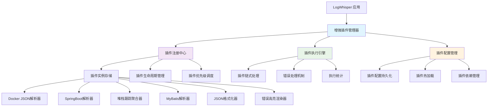
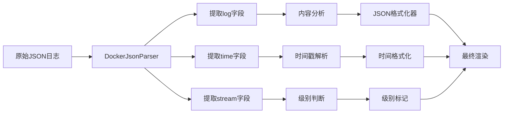

# LogWhisper 插件系统架构与扩展规划（增强版）

## 目录
- [1. 当前插件系统分析](#1-当前插件系统分析)
- [2. 增强插件系统架构](#2-增强插件系统架构)
- [3. 插件分类与职责](#3-插件分类与职责)
- [4. SpringBoot日志处理增强](#4-springboot日志处理增强)
- [5. 扩展性保障机制](#5-扩展性保障机制)
- [6. 插件开发规范](#6-插件开发规范)
- [7. 实现计划](#7-实现计划)
- [8. 总结与建议](#8-总结与建议)

---

## 1. 当前插件系统分析

### 1.1 现有实现问题

| 问题类型 | 具体问题 | 影响 | 解决方案 |
|---------|---------|------|---------|
| **架构问题** | 硬编码插件列表，缺乏真正插件架构 | 无法动态扩展 | 实现可插拔架构 |
| **SpringBoot支持** | JSON格式和堆栈跟踪处理不完善 | 日志识别和渲染错误 | 增强解析器和渲染器 |
| **插件优先级** | 缺乏插件链式处理机制 | 复杂日志格式处理失败 | 实现优先级调度 |
| **热加载** | 无插件热加载机制 | 需要重启服务 | 实现动态插件管理 |

### 1.2 SpringBoot日志格式挑战

#### JSON格式日志问题
```json
{"log":"[0.008s][info   ][gc,init] Memory: 15193M\n","stream":"stdout","time":"2025-09-16T08:17:32.180873992Z"}
```
- **问题**: 嵌套JSON结构，需要递归解析
- **影响**: 日志内容提取不准确，时间戳和级别识别错误

#### 堆栈跟踪聚合问题
```
2025-10-04 09:15:05.123 ERROR [http-nio-8080-exec-2] com.example.controller.ApiController : 处理请求时发生错误
java.lang.NullPointerException: Cannot invoke "String.trim()" because "input" is null
    at com.example.service.ValidationService.validateInput(ValidationService.java:45)
    at com.example.controller.ApiController.processRequest(ApiController.java:78)
```
- **问题**: 多行异常被分散处理，缺乏聚合逻辑
- **影响**: 异常信息不完整，调试困难

---

## 2. 增强插件系统架构

### 2.1 系统架构图



### 2.2 核心组件设计

#### 2.2.1 插件接口 (Plugin Trait)
```rust
pub trait Plugin: Send + Sync {
    fn name(&self) -> &str;
    fn version(&self) -> &str;
    fn description(&self) -> &str;
    fn priority(&self) -> u32;
    fn plugin_type(&self) -> PluginType;
    fn can_handle(&self, log_line: &str) -> bool;
    fn process(&self, log_entry: &mut LogEntry) -> Result<(), PluginError>;
    fn initialize(&mut self) -> Result<(), PluginError>;
    fn cleanup(&self) -> Result<(), PluginError>;
}
```

#### 2.2.2 插件类型分类
```rust
pub enum PluginType {
    Parser,    // 解析器：负责解析日志格式
    Renderer,  // 渲染器：负责美化显示
    Filter,    // 过滤器：负责过滤和聚合
    Analyzer,  // 分析器：负责日志分析
    Correlator,// 关联器：负责日志关联
}
```

#### 2.2.3 日志条目增强
```rust
pub struct LogEntry {
    pub line_number: usize,
    pub content: String,
    pub timestamp: Option<String>,
    pub level: Option<String>,
    pub formatted_content: Option<String>,
    pub metadata: HashMap<String, String>,
    pub processed_by: Vec<String>,
}
```

---

## 3. 插件分类与职责

### 3.1 解析器插件 (Parser Plugins)

| 插件名称 | 优先级 | 功能描述 | 支持格式 |
|---------|--------|---------|---------|
| **DockerJsonParser** | 10 | Docker容器JSON日志解析 | `{"log":"...","stream":"...","time":"..."}` |
| **SpringBootParser** | 5 | SpringBoot标准日志解析 | `2025-10-04 09:15:01.123 INFO [...]` |
| **MyBatisParser** | 20 | MyBatis SQL日志解析 | `Preparing:`, `Parameters:`, `Total:` |
| **GenericParser** | 1000 | 通用文本解析（兜底） | 任意文本格式 |

### 3.2 渲染器插件 (Renderer Plugins)

| 插件名称 | 优先级 | 功能描述 | 渲染效果 |
|---------|--------|---------|---------|
| **JsonFormatter** | 25 | JSON格式化和美化 | 缩进、高亮、折叠 |
| **StackTraceRenderer** | 15 | 堆栈跟踪美化渲染 | 语法高亮、行号、跳转 |
| **SqlRenderer** | 30 | SQL语句美化渲染 | 关键字高亮、格式化 |
| **ErrorHighlighter** | 5 | 错误信息高亮显示 | 错误级别颜色区分 |

### 3.3 过滤器插件 (Filter Plugins)

| 插件名称 | 优先级 | 功能描述 | 过滤逻辑 |
|---------|--------|---------|---------|
| **StackTraceAggregator** | 15 | 堆栈跟踪聚合 | 多行异常合并 |
| **LogDeduplicator** | 40 | 重复日志折叠 | 相似日志识别和折叠 |
| **TimeWindowFilter** | 35 | 时间窗口过滤 | 按时间范围过滤日志 |
| **LevelFilter** | 20 | 日志级别过滤 | 按级别过滤显示 |

### 3.4 分析器插件 (Analyzer Plugins)

| 插件名称 | 优先级 | 功能描述 | 分析能力 |
|---------|--------|---------|---------|
| **ReplicaAnalyzer** | 25 | 多副本日志行为对比 | 副本间差异分析 |
| **PerformanceAnalyzer** | 30 | 性能指标分析 | 响应时间、吞吐量分析 |
| **ErrorPatternAnalyzer** | 35 | 错误模式分析 | 错误趋势、模式识别 |

### 3.5 关联器插件 (Correlator Plugins)

| 插件名称 | 优先级 | 功能描述 | 关联能力 |
|---------|--------|---------|---------|
| **CorrelationTracker** | 30 | 业务关键词关联 | 跨容器日志聚合 |
| **RequestTracer** | 25 | 请求链路追踪 | 分布式请求跟踪 |
| **SessionCorrelator** | 35 | 会话关联分析 | 用户会话日志聚合 |

---

## 4. SpringBoot日志处理增强

### 4.1 JSON格式日志处理流程



### 4.2 堆栈跟踪聚合处理

```rust
// 堆栈跟踪聚合逻辑
fn aggregate_exception_lines(lines: &[&str]) -> Vec<LogEntry> {
    let mut entries = Vec::new();
    let mut i = 0;
    
    while i < lines.len() {
        let line = lines[i];
        
        // 检查是否是异常开始行
        if is_exception_start_line(line) {
            let mut exception_content = vec![line.to_string()];
            let mut j = i + 1;
            
            // 收集所有后续的堆栈跟踪行
            while j < lines.len() && is_stack_trace_line(lines[j]) {
                exception_content.push(lines[j].to_string());
                j += 1;
            }
            
            // 创建聚合的异常条目
            let full_content = exception_content.join("\n");
            let entry = LogEntry {
                line_number: i + 1,
                content: full_content,
                timestamp: extract_timestamp(line),
                level: extract_log_level(line),
                formatted_content: Some(exception_content.join("\n")),
            };
            entries.push(entry);
            
            // 跳过已处理的行
            i = j;
        } else {
            // 普通日志行
            let entry = LogEntry {
                line_number: i + 1,
                content: line.to_string(),
                timestamp: extract_timestamp(line),
                level: extract_log_level(line),
                formatted_content: Some(line.trim().to_string()),
            };
            entries.push(entry);
            i += 1;
        }
    }
    
    entries
}
```

### 4.3 MyBatis SQL日志处理

```rust
// MyBatis SQL日志处理逻辑
impl Plugin for MyBatisParser {
    fn can_handle(&self, log_line: &str) -> bool {
        log_line.contains("Preparing:") || 
        log_line.contains("Parameters:") ||
        log_line.contains("Total:")
    }
    
    fn process(&self, log_entry: &mut LogEntry) -> Result<(), PluginError> {
        if log_entry.content.contains("Preparing:") {
            log_entry.add_metadata("sql_type".to_string(), "preparing".to_string());
        } else if log_entry.content.contains("Parameters:") {
            log_entry.add_metadata("sql_type".to_string(), "parameters".to_string());
        } else if log_entry.content.contains("Total:") {
            log_entry.add_metadata("sql_type".to_string(), "result".to_string());
        }
        
        log_entry.add_metadata("format".to_string(), "mybatis".to_string());
        log_entry.mark_processed(self.name.clone());
        
        Ok(())
    }
}
```

---

## 5. 扩展性保障机制

### 5.1 插件优先级调度

```rust
// 插件优先级调度算法
fn get_plugins_by_priority(&self) -> Vec<&dyn Plugin> {
    let mut plugins: Vec<_> = self.plugins.values().map(|p| p.as_ref()).collect();
    plugins.sort_by_key(|p| p.priority());
    plugins
}
```

### 5.2 插件链式处理

```rust
// 插件链式处理逻辑
pub async fn process_log_entry(&self, mut log_entry: LogEntry) -> Result<LogEntry, PluginError> {
    let registry = self.registry.read().await;
    let plugins = registry.get_plugins_by_priority();
    
    for plugin in plugins {
        if plugin.can_handle(&log_entry.content) {
            match plugin.process(&mut log_entry) {
                Ok(_) => {
                    // 记录处理成功
                    if self.config.enable_stats {
                        // 更新统计信息
                    }
                }
                Err(e) => {
                    // 记录处理失败
                    if self.config.enable_stats {
                        // 更新错误统计
                    }
                    // 根据配置决定是否继续处理
                }
            }
        }
    }
    
    Ok(log_entry)
}
```

### 5.3 错误处理策略

```rust
pub enum ErrorStrategy {
    Continue,  // 继续执行后续插件
    Stop,      // 停止执行
    Retry { max_retries: u32 }, // 重试执行
}
```

### 5.4 插件热加载机制

```rust
// 插件热加载实现
pub async fn reload_plugins(&self) -> Result<(), PluginError> {
    // 1. 扫描插件目录
    let plugin_files = self.scan_plugin_directory().await?;
    
    // 2. 加载新插件
    for plugin_file in plugin_files {
        let plugin = self.load_plugin_from_file(&plugin_file).await?;
        self.registry.write().await.register(plugin).await?;
    }
    
    // 3. 清理无效插件
    self.cleanup_invalid_plugins().await?;
    
    Ok(())
}
```

---

## 6. 插件开发规范

### 6.1 插件开发模板

```rust
// 插件开发模板
pub struct CustomPlugin {
    name: String,
    version: String,
    description: String,
    priority: u32,
    // 插件特定字段
}

impl CustomPlugin {
    pub fn new() -> Self {
        Self {
            name: "custom_plugin".to_string(),
            version: "1.0.0".to_string(),
            description: "自定义插件".to_string(),
            priority: 50,
        }
    }
}

impl Plugin for CustomPlugin {
    fn name(&self) -> &str { &self.name }
    fn version(&self) -> &str { &self.version }
    fn description(&self) -> &str { &self.description }
    fn priority(&self) -> u32 { self.priority }
    fn plugin_type(&self) -> PluginType { PluginType::Parser }
    
    fn can_handle(&self, log_line: &str) -> bool {
        // 实现格式检测逻辑
        false
    }
    
    fn process(&self, log_entry: &mut LogEntry) -> Result<(), PluginError> {
        // 实现处理逻辑
        Ok(())
    }
    
    fn initialize(&mut self) -> Result<(), PluginError> {
        // 实现初始化逻辑
        Ok(())
    }
    
    fn cleanup(&self) -> Result<(), PluginError> {
        // 实现清理逻辑
        Ok(())
    }
}
```

### 6.2 插件配置规范

```rust
// 插件配置结构
#[derive(Debug, Clone, Serialize, Deserialize)]
pub struct PluginConfig {
    pub name: String,
    pub enabled: bool,
    pub priority: u32,
    pub settings: HashMap<String, serde_json::Value>,
}
```

### 6.3 插件测试规范

```rust
#[tokio::test]
async fn test_custom_plugin() {
    let plugin = CustomPlugin::new();
    
    // 测试格式识别
    let test_line = "test log line";
    assert!(plugin.can_handle(test_line));
    
    // 测试处理逻辑
    let mut log_entry = LogEntry::new(1, test_line.to_string());
    let result = plugin.process(&mut log_entry);
    assert!(result.is_ok());
    
    // 验证处理结果
    assert!(log_entry.is_processed_by("custom_plugin"));
}
```

---

## 7. 实现计划

### 7.1 第一阶段：核心架构实现 ✅

- [x] 插件接口定义
- [x] 插件注册中心
- [x] 插件执行引擎
- [x] 基础插件实现
- [x] 插件配置管理

### 7.2 第二阶段：SpringBoot日志处理增强

- [ ] 增强Docker JSON解析器
- [ ] 完善SpringBoot日志解析器
- [ ] 实现堆栈跟踪聚合器
- [ ] 优化MyBatis SQL解析器
- [ ] 增强JSON格式化器

### 7.3 第三阶段：高级功能实现

- [ ] 插件热加载机制
- [ ] 插件依赖管理
- [ ] 插件性能监控
- [ ] 插件错误恢复
- [ ] 插件配置持久化

### 7.4 第四阶段：扩展插件开发

- [ ] 日志分析插件
- [ ] 性能监控插件
- [ ] 错误模式识别插件
- [ ] 日志关联插件
- [ ] 自定义渲染插件

---

## 8. 总结与建议

### 8.1 架构优势

1. **可扩展性**: 插件架构支持动态扩展功能
2. **可维护性**: 模块化设计便于维护和调试
3. **可配置性**: 丰富的配置选项支持灵活定制
4. **高性能**: 优先级调度和链式处理优化性能
5. **容错性**: 完善的错误处理机制

### 8.2 SpringBoot日志处理能力

1. **JSON格式支持**: 完整的Docker JSON日志解析
2. **标准格式支持**: SpringBoot标准日志格式解析
3. **堆栈跟踪聚合**: 多行异常信息聚合处理
4. **SQL日志处理**: MyBatis SQL日志解析和美化
5. **JSON数据渲染**: 嵌套JSON数据格式化显示

### 8.3 扩展建议

1. **插件生态**: 建立插件开发社区和文档
2. **性能优化**: 实现插件缓存和批量处理
3. **监控告警**: 添加插件执行监控和告警
4. **配置管理**: 实现插件配置的版本控制
5. **测试覆盖**: 完善插件单元测试和集成测试

### 8.4 技术债务

1. **向后兼容**: 确保现有功能不受影响
2. **性能回归**: 监控插件系统对性能的影响
3. **内存管理**: 优化插件内存使用和生命周期
4. **错误处理**: 完善插件错误处理和恢复机制
5. **文档完善**: 补充插件开发和使用的详细文档

---

**总结**: 增强的插件系统架构为LogWhisper提供了强大的扩展能力，特别是对SpringBoot日志的全面支持。通过模块化设计和优先级调度，系统能够智能识别和处理各种日志格式，为用户提供更好的日志分析体验。